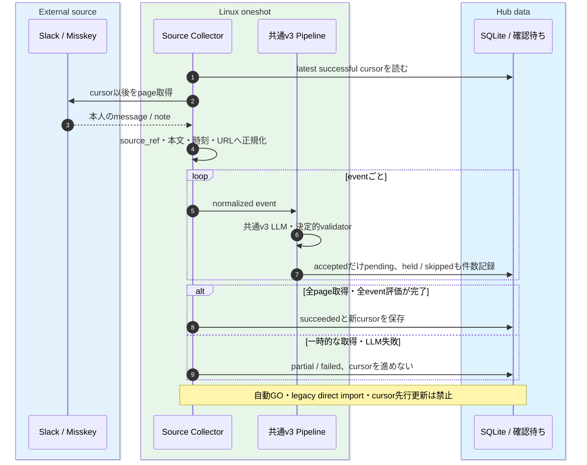

# Linux 常設サーバーの定期入口同期アーキテクチャ

作成日: 2026-07-10

## 目的

WindowsとLinuxの各入口workerから、タスク候補を確認待ちキューへ安全に反映する。Linuxから見えないWindows knowledge-vaultはWindows collectorが担当する。

既存の `devwork -> knowledge-vault` 定期収集とは責務を分ける。ここでは `knowledge-vault -> pj-general` を含む、pj-general 側の候補化を扱う。

## 採用方針

- Web サーバーの常駐状態に依存して同期を実行しない。
- Linuxから到達できる入口は`systemd timer`、Windows Vaultは初期手動確認後にWindows Task Schedulerが単発workerを起動する。
- Web の手動取り込みと定期 worker は、同じ domain / adapter の同期関数を呼ぶ。
- 初期は単一サーバーの SQLite 運用を維持する。複数writer、認証、規模、lock競合のいずれかが観測された時に PostgreSQL へ移行する。
- 将来は `workers/sync` の常駐 worker と Redis / BullMQ の定期 job へ移せる責務分割にする。

```text
Slack / Misskey / Web手入力        Windows knowledge-vault
                 |
                 v
        Linux source adapter          Windows collector + optional LLM
                 |
                 v
   candidate pipeline             SSH batch + Linux validator/importer
                 |
                 v
     PostgreSQL または P0 SQLite / 確認待ちキュー
                 |
                 v
             pj-general Web

systemd timer -> pj-general-sync.service -> workers/sync
```

## systemd 運用

- timer: `OnCalendar=*-*-* 00,06,12,18:00:00`
- missed run: `Persistent=true` を有効にし、停止中に逃した回を復帰後に実行する。
- service: `Type=oneshot`。同期の終了コードを systemd journal に残す。
- 排他: `flock` またはDB advisory lockで、前回実行が残っている場合の重複実行を防ぐ。
- secret: `/etc/pj-general/sync.env` など repo 外の環境ファイルまたは systemd credential から与える。
- 実行結果: source ごとの `last_success_at`、取得件数、候補化件数、skip件数、失敗内容を保存する。

### 現行oneshot実装

- worker本体: `workers/sync/run.py`
- systemd service: `infra/systemd/pj-general-sync.service`
- systemd timer: `infra/systemd/pj-general-sync.timer`
- secret / connector payloadの雛形: `infra/systemd/sync.env.example`

既存`workers/sync/run.py`のLinuxローカルvault scanと`--slack-payload`は、Linux側snapshotと旧direct importの回帰互換経路として残す。Windows本体のVaultは`infra/intake/import-knowledge-vault.ps1`でcollector・LLM・SSH batchを実行し、Linux側では`knowledge_vault_batch`として観測する。

通常のSlack / Misskey候補化は`docs/spec/ai-candidate-proposal-contract-p0.md`の共通v3を通す。現行oneshot workerはまだLLM呼出を持たないため、Slack / Misskeyの定期本流として有効化しない。定期化前に、Web serverへ依存せず`candidate_proposal.py`とOpenAI互換clientを呼ぶworker adapterへ更新し、action / aspiration、held、冪等性、source単位の失敗分離を回帰する。

## Slack / Misskey定期workerの固定実装設計

次セッションでは方式比較をやり直さず、以下を実装契約として使う。実サービスのtoken発行とtimer有効化は実装後のユーザー作業であり、fake HTTP回帰までは認証情報なしで完了できる。

### ファイル責務

| ファイル | 単一責務 |
| --- | --- |
| `workers/sync/run.py` | `--sources slack,misskey`のoneshot統括、source単位の失敗分離、worker間lock、終了コード、結果JSON |
| `workers/sync/http_client.py` | JSON HTTP、timeout、429の`Retry-After`、5xx再試行、secretを含まない一般化error |
| `workers/sync/slack_collector.py` | `memo-ideas`の差分取得、本人投稿filter、Slack payload正規化 |
| `workers/sync/misskey_collector.py` | 自分のnote差分取得、renote除外、Misskey payload正規化 |
| `workers/sync/llm_client.py` | 既存`LOCAL_LLM_*`設定でOpenAI互換/Ollamaへ共通v3を送信し、JSONだけを返す |
| `workers/sync/proposal_pipeline.py` | `candidate_proposal.py`のprompt組立・決定的validatorと`source_sync.py`のpending写像を再利用する。独自の候補判定を持たない |

Web serverのHTTP endpointは呼ばない。worker processが既存Python domainをimportし、同じSQLiteへ`source_sync_runs`とcandidateを保存する。`SyncLock`はworker同士の重複起動だけを防ぐ。Web手動取込との競合はSQLite transaction、既定5秒のbusy待機、決定的IDで解決し、`database is locked`なら当該sourceをfailedとしてcursorを進めない。手動取込をfile lockで待たせない。複数writer競合が継続観測されたらPostgreSQL移行ゲートを開く。

### 共通実行順



### Slack collector

- 取得APIは`conversations.history`、対象は`SLACK_CHANNEL_ID=C0BG4TCPAUD`（`memo-ideas`）だけとする。
- single-workspace内部appのbot tokenをrepo外の`SLACK_BOT_TOKEN`から読む。scopeは公開channelの履歴読取に必要な`channels:history`だけとし、botを対象channelへ参加させる。投稿・全workspace検索・DM読取scopeは付けない。
- `SLACK_OWNER_USER_ID`と一致する通常messageだけを対象にし、bot message、message subtype、空本文、thread replyはv1で除外する。他者の発言を本人のaspirationとして扱わない。
- 初回は管理者指定の`SLACK_INITIAL_OLDEST_TS`以後だけを読む。以後は最新成功runの`cursor_after`を`oldest`へ渡し、`inclusive=false`、`limit=15`、`response_metadata.next_cursor`が空になるまでpage取得する。
- `next_cursor`は実行内だけで使い、永続cursorは全page取得後の最大message `ts`とする。`source_ref`は`channel_id:ts`、URLは取得済みpermalinkがある場合だけ保持する。
- HTTP 429は`Retry-After`を尊重して1回だけ再試行する。待機上限は60秒。timeout / 5xxは1秒、2秒、4秒で最大3回まで再試行し、解消しなければSlackだけをfailedにする。

### Misskey collector

- 取得APIは`POST {MISSKEY_BASE_URL}/api/users/notes`とする。`MISSKEY_OWNER_USER_ID`を明示し、自分のnoteだけを取得する。access tokenが必要なvisibilityを含める場合だけrepo外の`MISSKEY_ACCESS_TOKEN`をbodyの`i`へ渡す。
- `limit=100`、`withRenotes=false`、`withReplies=true`、`withChannelNotes=true`とする。純粋renote、削除済み、`text`と`cw`がともに空のnoteは除外する。
- source本文は`cw`と`text`を原文順で改行連結し、validatorの完全一致根拠が正規化後本文に存在することを必須にする。`source_ref`はnote ID、URLは`{base}/notes/{id}`、時刻は`createdAt`とする。
- 最新成功runのnote IDを`sinceId`へ渡す。100件を超える場合は同じ`sinceId`を維持し、直前pageの最古IDを`untilId`へ渡して空pageまで取得する。全page取得後、最も新しい取得note IDだけを`cursor_after`へ保存する。
- 429は`Retry-After`を尊重して1回、timeout / 5xxはSlackと同じ回数で再試行する。Misskeyの失敗はSlack・既存候補・Tasksを止めない。

### 共通v3・cursor・commit規則

- normalized eventは1件ずつ`threadline-candidate-proposal-v3`へ渡す。相談回答、別event、過去会話を根拠本文へ混ぜない。
- deterministic validatorでheldになったeventは評価完了としてcursorを進めてよい。LLM timeout、不正HTTP、parse不能は未評価としてsourceを`partial`にし、`cursor_after=cursor_before`を維持する。
- partial runですでに作成したcandidateはcommitしてよい。次回は同じsource refから同じcandidate IDを作るため既存skipとなり、失敗eventだけが再評価される。
- source取得が0件でも成功runを残し、`cursor_after=cursor_before`とする。cursorは取得開始時やpage途中では更新しない。
- Slack / Misskeyに規則ベースfallbackを設けず、LLMを迂回した`legacy_direct`へ落とさない。LLM復旧後に同じcursorから再実行する。

### CLI・設定契約

- CLIは`python workers/sync/run.py --sources slack,misskey --db <path>`とする。未指定sourceは呼ばない。
- 外部sourceは`--commit`を付けない限りdry-runとする。dry-runは取得・共通v3・validatorまで実行するが、candidate、source run、cursorを一切書かず、本文を表示せずにsource別件数と一般化errorだけを返す。timerの`ExecStart`には、ユーザーが手動dry-runと手動commitを受入するまで`--commit`を付けない。
- 共通設定は`LOCAL_LLM_BASE_URL`または`OLLAMA_BASE_URL`、`LOCAL_LLM_MODEL`、`LOCAL_LLM_API_KEY`、`LOCAL_LLM_TIMEOUT_MS`を既存Hubと共有する。
- source設定は`SLACK_BOT_TOKEN`、`SLACK_CHANNEL_ID`、`SLACK_OWNER_USER_ID`、`SLACK_INITIAL_OLDEST_TS`、`MISSKEY_BASE_URL`、`MISSKEY_ACCESS_TOKEN`、`MISSKEY_OWNER_USER_ID`とする。
- env値、Authorization header、token、LLM API key、source本文をstdout / journal / `source_sync_runs.error`へ出さない。journalへ出すのはsource、run ID、state、件数、一般化error codeだけとする。

### 実装完了条件

1. fake Slack APIで複数page、本人filter、cursor再実行、429、5xxを回帰する。
2. fake Misskey APIで`sinceId + untilId`、renote/空note除外、100件超、429を回帰する。
3. fake LLMでaction / aspiration / held / timeoutを通し、acceptedだけpending、LLM失敗時cursor据置を確認する。
4. 同一payloadの2回実行でcandidate重複0、source runは2件、2回目created 0を確認する。
5. 一方のsource失敗時も他方がsucceededとなり、process全体は`partial`で終了する。
6. secret様文字列とsource本文がstdout、journal相当のcaptured log、DB error列へ出ないことを確認する。
7. `--commit`なしのdry-runでDB全tableが不変、`--commit`付きでだけsource run / candidate / cursorが更新されることを確認する。
8. fake回帰完了後もtimerは有効化せず、ユーザーが最小権限tokenと初期cursorを用意した後に手動dry-runを1回、承認後に手動commitを1回だけ実行する。

### 外部仕様根拠

- Slack `conversations.history`: <https://docs.slack.dev/reference/methods/conversations.history/>
- Slack token / scope: <https://docs.slack.dev/authentication/tokens/>
- Misskey API / access token: <https://misskey-hub.net/en/docs/for-developers/api/>
- Misskey `users/notes`のpagination前提は、対象Linux instanceの`/api-doc`でも実装直前に照合する。instance差異がある場合はcollector内のrequest mappingだけを変更し、共通v3・cursor commit規則は変えない。

Linuxへの初回登録例:

```bash
sudo install -m 0644 infra/systemd/pj-general-sync.service /etc/systemd/system/pj-general-sync.service
sudo install -m 0644 infra/systemd/pj-general-sync.timer /etc/systemd/system/pj-general-sync.timer
sudo install -d -m 0750 /etc/pj-general
sudo install -m 0600 infra/systemd/sync.env.example /etc/pj-general/sync.env
sudo systemctl daemon-reload
sudo systemctl enable --now pj-general-sync.timer
sudo systemctl start pj-general-sync.service
sudo systemctl status pj-general-sync.timer --no-pager
sudo journalctl -u pj-general-sync.service -n 100 --no-pager
```

systemd登録後も、まず`systemctl start`でoneshotを1回実行し、Hubの`/api/observability`でsource別runと件数を確認してからtimerを常用する。

## 同期契約

1. source adapter は source event を cursor または content hash で差分取得する。
2. 正規化済み event は `source_id + external_id`、または content hash を一意にして冪等に保存する。
3. candidate 化は共通v3 prompt / validatorを通し、event から再実行可能にして同一 event を重複候補にしない。旧direct importを通常経路へ戻さない。
4. 入口ごとの失敗は全体同期を止めず、source 単位で記録・再試行する。
5. 手動取り込みと定期同期は同じSQLite transaction境界と同一冪等キーを使う。worker起動lockは定期worker間だけで共有し、DB lock timeout時はcursorを進めず再実行する。

## P0 からの移行

P0はSQLiteとWindows手動batch取込を使う。管理画面からLinuxローカルscanは起動しない。手動で3回以上、誤候補率・修正率・重複0件を確認してからWindows Task Schedulerへ定期化する。PostgreSQLとRedis / BullMQは導入ゲートを満たした場合だけ追加する。
