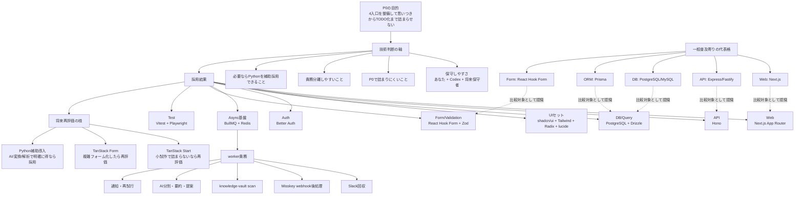

# 技術スタック判断表 2026-07

## 目的

この文書は、`tech-stack.md` の採用第一候補が、どの候補群との比較でそうなったかを見える化するための判断表である。

`tech-stack.md` が「現時点の正本」、この文書が「その判断根拠の一覧」という位置づけで使う。

## 判断前提

- 入口は自前実装
- AI と一緒に保守しやすい `explicit` な構成を優先する
- 100 万行規模まで伸びても責務分離しやすいことを重視する
- 流行だけでは採らず、P0 から段階的に切り出しやすいことを重視する
- 当面は Codex 専用運用で、TypeScript 主軸の monorepo を前提にする

## 一般普及寄りカラムの扱い

- ここでいう `世間一般でシェアのある技術` は、厳密な市場占有率ではない
- 領域ごとに計測基準が違い、単一の絶対指標が存在しないため、公開調査と実務上の普及感から `一般普及寄りの代表格` を置く
- 主な参照は `2024 Stack Overflow Developer Survey` と `State of JavaScript 2024`、および実務上の普及状況である

## 判断表

| 領域 | 元の候補群 | 一般普及寄りの代表格 | 採用結果 | 理由 | 期待される挙動 |
| --- | --- | --- | --- | --- | --- |
| 言語 / 実行基盤 | TypeScript + Node.js / Python 主体 / Go 主体 | JavaScript / TypeScript + Node.js | TypeScript + Node.js LTS | UI、API、worker、型共有を 1 言語で揃えやすい。ここでいう認知負荷は主に `あなた + Codex + 将来の保守者` の負荷。Python は補助採用を残し、本体分散は避ける。 | `apps`、`services`、`workers`、`packages` を同じ型体系で進められ、AI も横断修正しやすい。処理効率が必要な点だけ Python へ逃がせる。 |
| Package manager | pnpm / npm / Yarn / Bun | npm | pnpm | workspace と monorepo の運用実績が厚く、依存節約と速度のバランスが良い。Bun は魅力があるが、まずは安定側を取る。 | workspace が素直に管理でき、依存共有とインストール速度の両立がしやすい。 |
| Monorepo 実行基盤 | Turborepo / Nx / Lerna / 手組み scripts | Nx または Turborepo | Turborepo | `apps`、`services`、`packages`、`workers` を分ける今の構造と相性が良く、導入が軽い。Nx ほど重い前提を背負わずに済む。 | ビルド、lint、test、dev のタスクを段階導入しやすく、後から repo が大きくなっても破綻しにくい。 |
| Web framework | Next.js App Router / TanStack Start / 素の React + Vite | Next.js | Next.js App Router | 文書、事例、運用知見が厚く、BFF 近接処理にも向く。TanStack Start はかなり有力だが、今は `P0 を詰まらず出す安全側` を優先した。 | 入口 UI と横断ダッシュボードを早く起こしつつ、必要な API 近接処理も無理なく置ける。 |
| UI 基盤 | shadcn/ui / MUI / Chakra UI / Headless UI + 自前 | MUI か Tailwind 周辺 | shadcn/ui | 自分のコードとして持てるため、独自入口を育てやすい。AI が直接コンポーネントコードを読んで直しやすい点も強い。 | 入口 UI を細かく調整しやすく、OSS 借用思想とぶつからずに自前体験を作り込める。 |
| Style | Tailwind CSS / CSS Modules / styled-components / vanilla-extract | Tailwind CSS | Tailwind CSS | `shadcn/ui` との相性が良く、初速が出る。入口やダッシュボードの試行錯誤を、コンポーネント単位で素早く回しやすい。 | P0 の画面を早く組めて、後から共通 UI へ寄せる作業も比較的やりやすい。 |
| Icon | lucide-react / Heroicons / Tabler Icons | Heroicons か lucide-react | lucide-react | `shadcn/ui` 周辺で使いやすく、軽量で扱いやすい。差別化要因ではないため、相性の良い標準候補を選ぶのが合理的。 | 状態表示や操作導線を過不足なく付けられ、画面試作の速度を落とさない。 |
| API framework | Hono / Fastify / Next.js Route Handlers 主体 | Express / Fastify | Hono | `explicit` で薄く、Web 標準寄りで AI が壊しにくい。Fastify は有力だが、今は重厚さより読みやすさと切り出しやすさを優先した。 | `services/api` を薄い HTTP 境界として保ちやすく、worker や外部入口連携とも責務分離しやすい。 |
| DB | PostgreSQL / MySQL / SQLite / MongoDB | PostgreSQL / MySQL | PostgreSQL | 中核 object が多く、関係と履歴を強く持ちたい。全文検索や JSON も含め、初期から中期まで 1 基盤で粘りやすい。 | アイデア、タスク、予定、外部入口イベント、AI 提案結果を一貫した正本として持ちやすい。 |
| ORM / Query | Drizzle ORM / Prisma ORM / Kysely / 生 SQL 中心 | Prisma ORM | Drizzle ORM | SQL に近く、型とクエリの追跡がしやすい。Prisma は有力だが、抽象が一段厚く、今回の `後から読めること` 優先では Drizzle が勝つ。 | schema、migration、query を比較的見通し良く保てるため、AI と人間の両方が変更理由を追いやすい。 |
| Auth | Better Auth / Auth.js / Clerk / Lucia 系 | Auth.js / Clerk | Better Auth | framework-agnostic で、将来の `services/api` 分離にも馴染む。組織・アクセス制御の土台があり、AI 文脈の整備も比較的良い。 | 初期は自分専用寄りでも、後からロールや組織概念を足しやすい認証土台になる。 |
| Queue | BullMQ / Temporal / Inngest / pg-boss / 自前 cron | BullMQ / Inngest | BullMQ | Slack、knowledge-vault、Misskey、AI 分別、通知の非同期処理を、Redis ベースで素直に分けられる。Temporal ほど重くなくてよい。 | 定期回収、webhook 後処理、AI 提案、再試行を worker に逃がしやすく、P0 から拡張しやすい。 |
| Queue backend | Redis / PostgreSQL job queue / SQS 系 | Redis | Redis | BullMQ と自然に組み合わさり、P0 の非同期処理には十分。別マネージド基盤を最初から増やす複雑さを避けられる。 | ジョブ投入、遅延実行、再試行を実装しやすく、入口数が増えても初期は同じ枠組みで回せる。 |
| Form | React Hook Form / TanStack Form / Formik | React Hook Form | React Hook Form | 初期の入力密度では十分に強く、事例も多い。TanStack Form は魅力があるが、今は複雑さより導入の安定を優先する。 | 手入力フォーム、確認画面、管理画面の入力を早く揃えやすく、学習コストも抑えられる。 |
| Validation | Zod / Valibot / Yup / AJV 単独 | Zod / Yup | Zod | form、API、config の型境界を TypeScript と揃えやすい。採用済み周辺ライブラリとの相性も良く、実務上の摩擦が少ない。 | 入力値と外部入口 payload の検証を揃えやすく、壊れたデータの侵入を減らせる。 |
| Unit / Integration Test | Vitest / Jest / Node test runner | Jest / Vitest | Vitest | TypeScript と Vite 系ツールチェーンに馴染み、初速が出る。Jest ほど重い互換資産を必要としていない現段階に合う。 | domain、api、integration のテストを軽く足し始めやすく、P0 から検証習慣を作りやすい。 |
| E2E | Playwright / Cypress / WebdriverIO | Playwright / Cypress | Playwright | 複数画面と入力導線、将来の外部入口確認まで見据えると扱いやすい。現代的な E2E の標準寄りで情報も厚い。 | 書き入れ口、ダッシュボード、確認導線のブラウザ挙動を自動で確認しやすい。 |
| Lint / Format | ESLint + Prettier / Biome | ESLint + Prettier | ESLint / Prettier | 現時点では最も無難で、既存資産や AI の期待ともズレにくい。Biome は魅力があるが、まずは保守性優先でよい。 | repo 全体の整形と静的検査を揃えやすく、レビュー時のノイズを減らせる。 |
| ローカル基盤 | Docker Desktop + compose / 直接ローカル install / Dev Container 主体 | Docker + compose | Docker Desktop + compose | PostgreSQL と Redis をローカルに直接散らさず、状態を揃えやすい。P0 の再現性を確保しやすい。 | 新規環境でも DB と Redis を同じ手順で起動しやすく、セットアップ差異を減らせる。 |
| Web と API の切り方 | `apps/web` のみ / `apps/web` + `services/api` / 完全マイクロサービス化 | `apps/web` のみ から始める例が多い | `apps/web` + `services/api` 前提 | UI と業務 API を早めに分ける思想は必要。ただし実装初期は近接処理も許容する、という折衷が今の要件に合う。 | P0 は速く出しつつ、後から `services/api` を本格化しても破綻しにくい構造を保てる。 |
| 外部入口取り込み方式 | Web 手入力 / Slack polling or event / Misskey webhook / knowledge-vault scan | 手入力 + webhook/polling 混在 | 入口ごとに分ける | 入口ごとに性質が違うため、単一方式に寄せない方が素直。Misskey は webhook、knowledge-vault は scan、Web は即時登録が自然。 | P0 で `web`、`Slack`、`Misskey`、`knowledge-vault` を無理に統一せず、それぞれ最短経路で ingestion できる。 |

## 補足 1: 「誰の認知負荷か」

`TypeScript + Node.js` を主軸にする理由で書いた `認知負荷` は、主に次の 3 者の負荷を指す。

- あなた自身
- Codex
- 将来この repo を触る保守者

つまり、`UI は TypeScript、API は TypeScript、worker は Python、補助スクリプトも Python、さらに一部は Go` のように本体ロジックが散ると、次が重くなる。

- データ構造の追跡
- バグ切り分け
- AI への修正指示
- 入口追加時の横断改修

ただし、これは `Python を禁止する` という意味ではない。  
今回の方針は次である。

- 本体の業務ロジックは TypeScript に寄せる
- 処理効率やライブラリ都合で明確な利点がある部分だけ Python を併用する

### Python 併用に向く条件

- LLM 前処理、埋め込み、分類検証などで Python のライブラリ優位が大きい
- 大量テキスト整形、CSV / Markdown / PDF 変換など補助処理
- 将来、AI バッチや解析で Node 実装より明確に楽・速い部分

つまり、`複合採用にするなら、UI/API/正本ドメインは TypeScript、AI 補助や重い変換は Python` が一番自然である。

## 補足 2: TanStack Start はどれくらい有力か

温度感としては、`採用してもおかしくないが、今すぐ本命へ上げるにはまだ理由不足` である。

### TanStack Start を上げたくなる点

- 新しく、設計思想がかなり整理されている
- 型とデータ取得まわりの一貫性が高い
- React 周辺のモダンな流れにかなり近い

### 今すぐ本命にしていない理由

- `Next.js` の方が docs、事例、保守知見、AI の既知パターンが厚い
- この PJ は入口、外部取り込み、worker、API 境界まであり、P0 で詰まりにくい方が重要
- 新技術を使うこと自体は目的ではなく、P0 をちゃんと出すことが目的

### TanStack Start を採る条件

- まず P0 を出す速度より、設計の新しさと一貫性を優先したい
- 小さめの縦スライスで先に試して、詰まりが少ないと確認できる
- `Next.js` 固有機能を強く必要としない

結論として、`今すぐ全面採用` より `別 branch か小試作で触って判断` が妥当である。

## 補足 3: shadcn/ui と合わせて扱いやすい見た目セット

`shadcn/ui` は単体採用というより、次のセットで考えると分かりやすい。

### 今の本命セット

- `shadcn/ui`
- `Tailwind CSS`
- `Radix UI primitives`
- `lucide-react`
- `React Hook Form`
- `Zod`

### このセットの意味

- `shadcn/ui`
  - 画面部品の土台
- `Tailwind CSS`
  - スタイリングの速度
- `Radix UI`
  - アクセシブルな primitive
- `lucide-react`
  - アイコン
- `React Hook Form`
  - フォーム状態
- `Zod`
  - 入力検証

### 期待される見た目と開発体験

- 画面部品を早く並べられる
- 入力フォームと validation を同じ流れで組める
- 入口 UI や確認画面の改修を AI が追いやすい
- 将来コンポーネントを `packages/ui` に寄せやすい

## 補足 4: Queue と Queue backend は今回どれくらい大事か

かなり大事である。  
今回の PJ では、`非同期でよい処理を同期 HTTP に押し込まないこと` が重要になる。

### Queue が担当する主な仕事

- Slack の定期回収
- knowledge-vault の scan
- Misskey webhook 受信後の後処理
- AI 分別
- タスク案生成
- 予定案生成
- Google Calendar 連携の再試行
- 通知

### Queue がないと何が起きるか

- Web のレスポンスが遅くなる
- 外部 API が遅い時に UI が詰まる
- AI 処理失敗時の再試行管理が雑になる
- 入口が増えるほど処理順と状態管理が崩れる

### 今回の PJ での役割イメージ

- `web`
  - 受け付ける、GO を出す
- `api`
  - 正本更新とジョブ投入をする
- `queue`
  - 時間のかかる処理を並べる
- `workers`
  - 実際に回収、AI 整理、通知を実行する

つまり Queue は `おまけ` ではなく、入口が 4 つある P0 ではかなり中核に近い。

## 補足 5: TanStack Form はどういう状況で導入するか

今すぐ採る必要はないが、次の条件なら導入再検討してよい。

### 導入を考える状況

- 入力フォームがかなり複雑になる
- 画面ごとの部分再描画や granular subscription が効いてくる
- 型安全なフォームロジックをより前面に出したい
- `React Hook Form` の抽象や運用が窮屈になってきた

### 今すぐ採らない理由

- 初期版で最優先なのは `書き入れ口の速さ` と `確認フローの素直さ`
- `React Hook Form` の方が知見と事例が厚く、P0 での詰まりが少ない
- フォームの本当の複雑さは、設計書を起こしてからでないとまだ見切れない

結論としては、`P0 は React Hook Form`、`複雑フォームが増えたら TanStack Form を再評価` が妥当である。

## Mermaid 概念図

## 既存文書との関係

- 正本:
  - `tech-stack.md`
- 比較根拠:
  - `docs/arch/practical-ai-friendly-stack-2026-06.md`
  - `docs/arch/recommended-oss-and-stack-composition.md`
  - `docs/arch/pm-oss-layered-architecture.md`
- 要件側の前提:
  - `docs/imp/user-requirements-answers-2026-06-29.md`

## 今回追加で明示したこと

- `一般普及寄りの代表格` カラムを追加した
- `認知負荷` が誰のものかを明示した
- `Python を補助採用する条件` を切り出した
- `TanStack Start` と `TanStack Form` の再評価条件を明示した
- `shadcn/ui` 周辺の実務セットをまとめた
- Queue と Redis が今回どれくらい中核かを説明した
