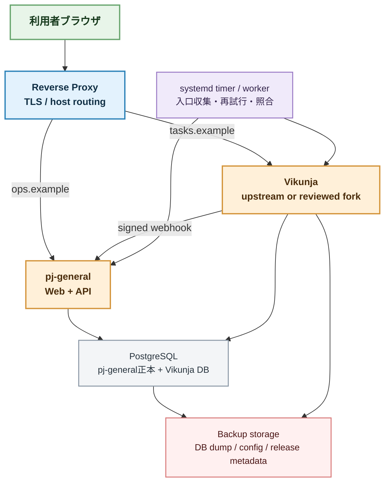

# Vikunja / pj-general Linux配置・運用設計 2026-07

## 目的

Linux常設サーバー上で、Vikunjaとpj-generalを実データで接続するための配置・運用設計を定める。
Windows開発環境でVikunja本体を無理に再現せず、サーバーが用意された時に同じ構成を起動して検証できることを目的にする。

## 推奨配置

## 配置前提

- Linux: Ubuntu LTSまたは同等のsystemd環境。
- 公開入口: `pj-general`とVikunjaを別hostまたはpathで分離する。
- 実行方式: Docker Composeを第一候補にする。Dockerが使えない場合はsystemdで公式バイナリを起動する。
- DB: P0検証はSQLiteを許容するが、常設運用はPostgreSQLを第一候補にする。
- HTTPS: Reverse Proxyで終端し、Webhook受信をTLS必須にする。
- 認証情報: API token、Webhook secret、DB passwordはリポジトリやSQLite設定へ保存しない。
- pj-general側の候補・判断・出典はVikunjaへ移さず、pj-general DBを正本にする。

## ネットワーク境界

| 経路 | 公開範囲 | 認証・検証 |
| --- | --- | --- |
| ブラウザ -> pj-general | ユーザー向け | pj-general認証を後続導入 |
| ブラウザ -> Vikunja | ユーザー向け | Vikunja認証 |
| pj-general -> Vikunja API | 内部またはTLS | API token、timeout、retry |
| Vikunja -> pj-general Webhook | Reverse Proxy経由 | HMAC署名、event identityまたはpayload hash冪等性 |
| systemd worker -> 各入口 | 必要な外向き通信 | sourceごとのtoken、取得結果記録 |

## 起動順

1. PostgreSQLとバックアップ先の状態を確認する。
2. Vikunjaを起動し、health/API応答を確認する。
3. pj-general APIを起動し、DB migrationとhealthを確認する。
4. Webhook受信を有効にする。
5. `GO -> Vikunja task作成`を1件で検証する。
6. Vikunja画面からtaskを完了し、Webhook反映を確認する。
7. systemd timerを有効化する。

## バックアップ・復旧

- Vikunja DBとpj-general DBは別々にバックアップし、復旧順を記録する。
- 毎日のDB dump、設定ファイル、Vikunja/PJ release version、plugin/fork commitを保存する。
- 復旧後は、`execution_links`とVikunja taskの対応を照合する。
- Webhook payloadは無期限に保持せず、監査に必要な期間を設定する。ただしevent identityまたはpayload hash、処理状態、失敗理由は履歴として残す。

## 更新手順

1. Vikunja upstream releaseと変更点を確認する。
2. 先にDB backupを取得する。
3. fork/pluginを使っている場合は対応commitとAPI差分を確認する。
4. stagingまたは一時projectでmigration、API登録、Webhookを検証する。
5. 本番更新後、health、ログイン、task作成、完了Webhook、バックアップを確認する。
6. `docs/diary`と実装完了記録へ、upstream差分と実際の変更を記録する。

## サーバー準備チェックリスト

- [ ] Linux SSH接続が可能
- [ ] Docker ComposeまたはGo公式バイナリ実行方式を選択
- [ ] DNS / host名を用意
- [ ] TLS証明書を用意
- [ ] PostgreSQLの保存領域とバックアップ領域を用意
- [ ] Vikunja projectと管理者/API tokenを用意
- [ ] Webhookからpj-generalへ到達可能
- [ ] systemd timerの実行ユーザー・ログ方針を決定
