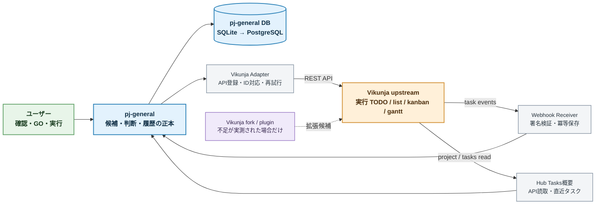
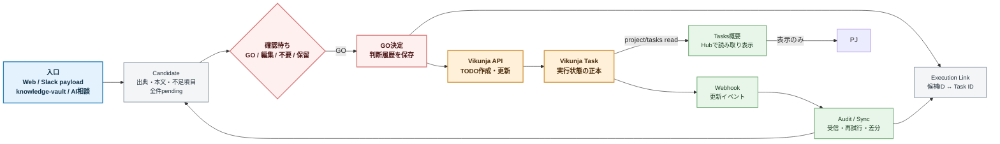
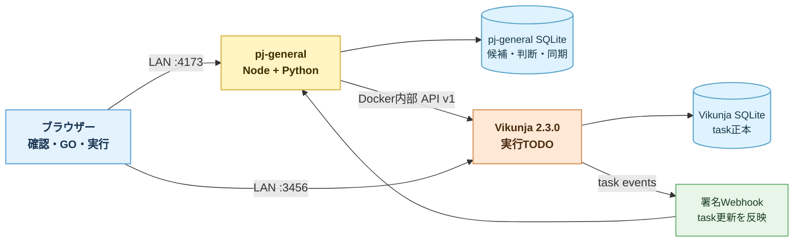

# Vikunja / pj-general 結合アーキテクチャ 2026-07

## 目的

`pj-general` の確認待ち候補と、Vikunja の実行 TODO を実データで結合する。
この文書は、Vikunja を先にフォークして仕様を決め打ちするのではなく、upstream 版を連結して実際の不足を観測したうえで、拡張方式を決めるための設計正本である。

## 結論

- `pj-general` は入口、AI候補、出典、判断、履歴、Vikunjaとの対応関係を保持する正本とする。
- Vikunja は GO 済み候補を実行する TODO 基盤とする。
- 初期の登録は `pj-general -> Vikunja REST API` とする。
- HubのダッシュボードはVikunja APIからプロジェクト概要と直近タスクを読み取り、Tasks側への導線を提供する。
- 実行状態の戻しは `Vikunja Webhook / 再照合 -> pj-general` の状態ミラーに限定する。候補本文や判断をVikunjaからHubへ逆同期しない。
- GO後のタスク実行、期限、担当、進捗、完了操作はVikunja側で完結させる。Hubは入口、候補、GO判断、連携状態の確認に集中する。
- Vikunja の plugin / fork は、upstream 連結後に不足を実測してから選ぶ。
- 初回結合は安定版 `v2.3.0` を固定し、API v1との差分をadapterへ閉じ込める。mainのAPI v2を初回契約に混ぜない。
- UI変更は frontend fork、Vikunja内部のAPI・イベント・追加テーブルは backend plugin、コアの権限・状態・データモデル変更だけ backend fork の候補とする。

## コンポーネント図

## データフロー図

## 責務境界

| 領域 | pj-general | Vikunja | 初期の扱い |
| --- | --- | --- | --- |
| 原文・出典 | 正本 | リンクまたは要約のみ | pj-generalに保持 |
| AI候補 | 正本 | 原則保持しない | GO前はVikunjaへ送らない |
| GO判断・判断履歴 | 正本 | 実行タスク作成の結果だけ | `decisions` に保存 |
| 実行TODO | 対応IDと要約を保持 | 正本 | VikunjaへAPI登録 |
| 期限・担当・進捗 | ミラー・履歴 | 正本 | Webhookで戻す |
| plugin固有データ | 必要な参照IDのみ | Vikunja pluginの追加テーブル | pluginが必要になった時だけ |
| UI | 入口・確認・横断表示 | TODO実行画面 | UI要件が固まってからfrontend fork |

## P0の導線と一方向境界

- `Intake -> Hub` は入口データを候補化し、`Hub -> Tasks` はユーザーのGO判断後に実行タスクを登録する一方向の作成導線とする。
- 登録時は候補のタイトル、要約、TODO案、候補IDなどをTasks側へ渡す。登録後のタスク本文・期限・担当・進捗はTasks側で編集する。
- Hubはページ表示時のVikunja API読取でプロジェクト概要と直近タスクを表示し、SQLiteへ別のタスク一覧を複製しない。SQLiteには候補との対応リンクとWebhook / 再照合で得た状態ミラーだけを保持する。
- Webhookと再照合は「Tasks側の実行状態をHubの確認表示へ戻す」ためのものであり、候補本文やGO判断を書き換える双方向同期ではない。
- Hub内のTasks連携予定表示は既存候補の補助表示として残せるが、主導線はTasks側のTODO・ガント画面とし、HubのナビゲーションからTasks側プロジェクトへ直接遷移できるようにする。

## 拡張方式の判断

### 先に実装する範囲

- upstream Vikunjaを無改変で起動する。
- project、API token、Webhookを実環境で用意する。
- `GO` で実際のVikunja taskを作成する。
- task URLと外部IDをpj-generalへ保存する。
- Vikunja側で状態・期限・担当を変更し、Webhookでpj-generalへ戻す。
- 実際に不足した操作・データ・画面を不足機能一覧へ記録する。

### pluginへ寄せる条件

- Vikunja内部のイベント直後に処理する必要がある。
- Vikunja APIの外側ではなく、Vikunja認証済みの追加APIが必要である。
- Vikunja側に追加テーブルが必要だが、コアモデルの変更までは不要である。

### frontend forkへ寄せる条件

- TODO画面のレイアウト、詳細pane、導線、操作を変更しないと日常運用できない。
- pj-generalの独自情報をVikunja内で常時表示したい。
- 標準画面へのリンクだけでは操作負荷が高い。

### backend forkへ寄せる条件

- 権限、状態遷移、プロジェクト、タスクの中核モデルを変更する必要がある。
- API / plugin / 外部連携ではデータ整合性を保証できない。
- その変更をupstream追随コスト込みで保有する判断が完了している。

## 実行環境

- ソースクローン: `G:\devwork\clone-dir\vikunja-upstream`
- GitHub fork: `https://github.com/rohto4/vikunja` を作成済み。初期はupstreamとの差分なしで保持する
- Windows開発環境: Docker / WSL / Go がPATHにないため、ソース確認と実行バイナリを分離する
- Linux常設環境: Vikunja本体、pj-general API、Webhook receiverをComposeで配置する。P1初期もSQLiteを許容し、複数writer・認証・規模・lock競合の導入ゲートを満たした時だけPostgreSQLへ移行する
- 初回実機結合: SQLiteで境界、ID対応、冪等性を検証済み

## P0完了の受入条件

- 実在するVikunja projectへ、pj-generalのGO操作から実在するtaskが作成される。
- 同じ候補を再度GOしても二重taskを作らない。
- Vikunjaでtaskを完了・変更した結果が、pj-generalの対応候補へ反映される。
- 外部API失敗時に、判断履歴を失わず、再試行対象として記録できる。
- 元の入口、候補、判断、外部taskの対応関係をDBから追跡できる。
- fork / pluginを使った場合は、その理由とupstream追随方法が記録されている。

## 2026-07-11 実装結果

### 実装済み

- 実SQLite候補から`PUT /api/v1/projects/{project}/tasks`で実taskを作成する。
- `execution_links.candidate_id`により同じ候補の二重task作成を防ぐ。
- API内部URLとブラウザー公開URLを分離する。
- Webhook署名、payload hash冪等キー、task state反映を実装済み。
- Webhook欠落時は再照合APIがVikunja taskを取得し、更新または`detached`を反映する。
- Linux上でpj-generalとVikunjaを別コンテナ・別SQLiteとして起動済み。

### 実Webhookの運用境界

専用Docker network内に限定して`outgoingrequests.allownonroutableips`を有効化した。target URLはpj-general serviceへ固定し、HMAC署名、payload hash冪等保存、定期再照合を併用する。実taskの未完了・完了変更がpj-generalへ反映されることを確認済み。

## 2026-07-12 frontend fork結果

- frontend forkを採用し、Hubと共通のListening Loungeへ統一した。
- branchは `codex/pj-general-dashboard`、最終local commitは `325bc5475`。
- project dashboard、今日から30日、未日付task、既存view導線を実データで確認した。
- backend API、認証、権限、Webhook契約は変更していない。
- Linux常設配信、stable rollback、upstream追随はP1の運用タスクとする。

## 利用者導線・障害時の合流点

利用者はHubで入口・候補・GO判断を扱い、GO成功後はTasksでtitle、期限、担当、進捗、完了を扱う。Hubに戻るのは、実行状態の確認、候補の出典・判断履歴、またはTasksへの再遷移が必要な場合だけである。この体験上の一続きは `docs/product/p0-overall-workflow-2026-07.md`、Hub側の操作状態は `docs/spec/hub-ui-interaction-contract-p0.md`、Tasks側の画面契約は `docs/spec/thread-line-tasks-ui-contract-p0.md` を正本とする。

外部境界の障害は、候補・判断・taskの正本を混ぜて復旧しない。Vikunja API失敗ではHubのGO判断と試行履歴を保持し、Webhook欠落・外部削除ではreconcileでmirrorだけを更新する。frontend forkの配信不具合ではstable imageへ戻し、Hub SQLiteやVikunja DBを削除・再インポートしない。実際の復旧順は `docs/ops/p0-operations-runbook-2026-07.md`、Linuxへのsource-only配信は `docs/guide/linux-listening-lounge-deploy.md`、回帰/実機受入は `docs/spec/vikunja-integration-acceptance-tests-2026-07.md` と `docs/imp/p0-frontend-acceptance-checklist-2026-07-12.html` を参照する。
