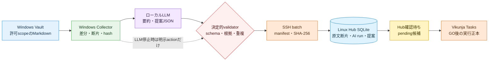

# Windows knowledge-vault AI取込アーキテクチャ 2026-07

## 目的

Windowsの`G:\knowledge-vault`を読み、ローカルLLMによる要約・タスク提案を、Linux上のHub SQLiteへ由来付きで安全に格納する。LLMは提案だけを作り、Hub候補の確認、GO、Vikunja task作成の既存境界を越えない。

## 採用構成

## 責務

| 境界 | 責務 | 禁止 |
| --- | --- | --- |
| Windows collector | allowlist scan、UTF-8読込、断片化、content hash、LLM呼出、batch生成 | SQLite書込、GO、秘密のbatch格納 |
| ローカルLLM | 共通v2による文書要約と根拠付きaction / aspiration提案JSON | candidate/Tasks直接更新、aspirationの架空具体化、根拠外の期限・担当・Project補完 |
| validator | schema、完全一致引用、長さ、enum、許可タグ、曖昧title、完了事項を検査 | LLM自己申告confidenceだけで採否決定 |
| SSH transport | batchとmanifestを専用鍵で転送しSHA-256照合 | SQLiteファイル転送、新しいLAN書込API公開 |
| Linux importer | batchをtransactionで冪等保存し、accepted提案だけを`pending`候補へ写像 | Vaultへの逆書込、自動GO、Vikunja直接更新 |
| Hub / Vikunja | Hubで編集・判断し、GO後だけVikunjaへ一方向登録 | LLM障害による既存候補・taskのrollback |

## 障害境界

- LLM未設定・timeout・不正JSONでは、明示された未完了`Next Actions`だけを規則ベース提案にする。推測候補は作らない。
- 1文書のLLM失敗はbatch全体を破棄せず、`ai_runs.status=fallback`として残す。
- manifest不一致、schema不一致、未知のversionはLinux SQLiteを書かずに失敗する。
- 同じ`batch_id`、`document_id`、`proposal_id`の再取込は既存行を返し、candidateを二重作成しない。
- LinuxだけをSQLite writerとし、Windows共有ドライブやSCPでSQLite本体を扱わない。

## 実装境界

- collector / validator / importer: `apps/web/vault_intake.py`
- 共通候補契約: `docs/spec/ai-candidate-proposal-contract-p0.md`
- prompt正本: `apps/web/prompts/threadline-candidate-proposal-v2.txt`
- 決定的validator: `apps/web/candidate_proposal.py`
- SQLite: `apps/web/db_tool.py`
- Windows→Linux運用: `infra/intake/import-knowledge-vault.ps1`、`infra/intake/import-knowledge-vault-remote.sh`
- 回帰: `apps/web/test/test_vault_intake.py`、`infra/intake/test_import_knowledge_vault.py`

## 関連正本

- `docs/spec/knowledge-vault-ai-intake-contract-p0.md`
- `docs/data/knowledge-vault-ai-intake-data-design-2026-07.md`
- `docs/ops/knowledge-vault-ai-intake-runbook-2026-07.md`
- `docs/spec/intake-source-adapters.md`
- `docs/spec/confirmation-queue-p0.md`
