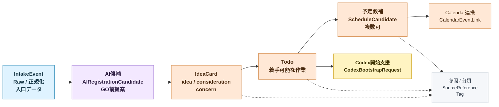

# P0 初期業務オブジェクトモデル

作成日: 2026-07-02

## 目的

この文書は、P0 で扱う主要業務 object の初期モデルを定義する。

ここでは DB schema を確定しない。画面、AI 整理、登録フロー、予定化フローが同じ言葉で話せるように、object の責務と最小属性を固定する。

## 前提

- `アイデアカード` と `TODO` は別 object とする。
- `検討事項` と `気になっている事` は分ける。
- 1 つの入力から `TODO` と `予定候補` の両方が生まれてよい。
- TODO 化や予定化の最低条件は厳密に置かない。
- AI が不足情報を提案し、ユーザーが訂正して GO できることを優先する。

## Object 一覧

| Object | 役割 | P0 での位置づけ |
| --- | --- | --- |
| `IntakeEvent` | 入口から来た元データ | Raw / 正規化イベントとして保持 |
| `AIRegistrationCandidate` | AI 整理結果 | GO 前の提案 |
| `IdeaCard` | 思いつき、検討事項、気になっている事の受け皿 | 入力プールの中心 |
| `Todo` | 着手可能な作業 | P0 の主 object |
| `ScheduleCandidate` | 予定化の提案 | Google Calendar 登録前の候補 |
| `CalendarEventLink` | 外部 Calendar との対応 | 登録後の追跡用 |
| `Tag` | 分類マスタ | AI とユーザーが共通利用 |
| `SourceReference` | URL や元イベントへの参照 | 内部追跡用 |
| `CodexBootstrapRequest` | Codex PJ 開始支援 | P0 最小機能として扱う |

## IdeaCard

### 役割

思いつき、検討事項、気になっていることを雑に受け止める object。

### 種別

| subtype | 意味 |
| --- | --- |
| `idea` | 具体化前の思いつき |
| `consideration` | もう進めたい検討事項 |
| `concern` | ニュース記事、テーマ、気になっている事 |

### 最小属性

| Field | 意味 |
| --- | --- |
| `id` | ID |
| `subtype` | `idea` / `consideration` / `concern` |
| `title` | タイトル |
| `summary` | 要約 |
| `body` | 任意の本文 |
| `status` | `active` / `promoted` / `archived` |
| `tags` | タグ |
| `source_references` | 元イベントや URL |
| `created_at` | 作成時刻 |
| `promoted_at` | TODO 化などで昇格した時刻 |

### 表示方針

- 初期一覧は時系列積み上げ。
- `promoted` 後は通常一覧から退ける。
- ただし論理削除に近い扱いで、アーカイブから参照できる。

## Todo

### 役割

ユーザーが着手できる作業を表す object。

### 最小属性

| Field | 意味 |
| --- | --- |
| `id` | ID |
| `title` | タイトル |
| `summary` | 任意の要約 |
| `status` | `draft` / `active` / `scheduled` / `done` / `archived` |
| `estimated_minutes` | 所要時間案 |
| `tags` | タグ |
| `related_links` | 関連リンク |
| `source_idea_card_id` | 元アイデアカード |
| `source_candidate_id` | 元AI整理結果 |
| `created_at` | 作成時刻 |

### P0 表示項目

- タイトル
- 所要時間案
- 関連リンク
- タグ

期限候補や優先度は有用だが、P0 の必須表示項目としてはまだ仮置きにする。

## ScheduleCandidate

### 役割

TODO を Google Calendar などへ登録する前の予定候補。

### 最小属性

| Field | 意味 |
| --- | --- |
| `id` | ID |
| `todo_id` | 対象 TODO |
| `title` | 予定タイトル |
| `start_candidate` | 開始候補 |
| `end_candidate` | 終了候補 |
| `duration_minutes` | 所要時間 |
| `status` | `proposed` / `approved` / `registered` / `rejected` |
| `reason_note` | AI が提案した短い理由 |

### 方針

- 1 TODO から複数 ScheduleCandidate が生まれてよい。
- Google Calendar 直接登録はユーザー GO が必要。
- 登録導線は `TODO 概要`、`TODO 詳細`、`予定候補一覧` に置く。

## CalendarEventLink

### 役割

外部 Calendar へ登録した予定との対応を保持する。

### 最小属性

| Field | 意味 |
| --- | --- |
| `id` | ID |
| `schedule_candidate_id` | 元予定候補 |
| `provider` | `google_calendar` など |
| `external_event_id` | 外部予定ID |
| `registered_at` | 登録時刻 |
| `sync_status` | `registered` / `sync_error` / `deleted_external` |

## Tag

### 役割

AI と人間が共通で使う分類マスタ。

### 最小属性

| Field | 意味 |
| --- | --- |
| `id` | ID |
| `name` | 表示名 |
| `kind` | `topic` / `work_type` / `source` / `custom` |
| `status` | `active` / `archived` |

P0 ではタグ体系を作り込み過ぎず、AI が選びやすく、人が増やせることを優先する。

## SourceReference

### 役割

元データや URL へ戻るための参照情報。

### 最小属性

| Field | 意味 |
| --- | --- |
| `id` | ID |
| `source_type` | `web` / `slack` / `misskey` / `knowledge_vault` / `url` |
| `source_ref` | 元イベントID、path、URL など |
| `source_url` | URL がある場合 |
| `label` | 人間向けの短い表示名 |

表示上は必ずしも出さないが、内部追跡用に保持する。

## CodexBootstrapRequest

### 役割

TODO や作業名を元に、Codex 用の新規 PJ 開始を補助する object。

### P0 最小機能

- Web からタスク名を元にフォルダ新規作成する。
- フォルダ命名は手動でよい。
- 初期プロンプトを出力する。
- プロンプトテンプレートは管理画面から編集可能にする。

### 最小属性

| Field | 意味 |
| --- | --- |
| `id` | ID |
| `todo_id` | 元 TODO。任意 |
| `project_name` | PJ 名 |
| `folder_path` | 作成予定または作成済み path |
| `prompt_template_id` | 利用テンプレート |
| `generated_prompt` | 出力プロンプト |
| `status` | `draft` / `created` / `archived` |

## 関係

## P0 で決めること

- `IdeaCard` と `Todo` は分ける。
- `IdeaCard` は `idea`、`consideration`、`concern` の subtype を持つ。
- `Todo` の最小表示項目は `タイトル`、`所要時間案`、`関連リンク`、`タグ`。
- `ScheduleCandidate` は TODO から複数作れる。
- `SourceReference` は内部追跡用に残す。
- `CodexBootstrapRequest` は P0 の最小機能として object 化する。

## P0 では決めないこと

- 正確な DB table 名。
- `priority`、`deadline`、`assignee` の P0 必須化。
- ガント表示の詳細 object。
- キャパ管理の object 詳細。
- 外部協力者向け権限の完全設計。

## 後続設計

- `docs/spec/google-calendar-linkage-flow.md`
- `docs/spec/codex-project-bootstrap-flow.md`
- `docs/spec/role-and-permission-initial.md`
- `docs/data/history-and-audit-model.md`
