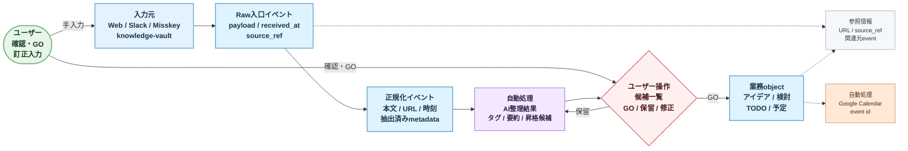

# P0 データフロー図 2026-07

## 目的

この文書は、P0 で 4 入口から入った情報が、どのデータ状態を経て業務 object へ変換されるかを要約する。

業務操作の順番ではなく、データの形と正本化の流れにフォーカスする。

## 前提

- P0 の入口は `web 手入力`、`Slack`、`Misskey`、`knowledge-vault`
- 重複は初期版では許容する
- 表示上の出典は必須ではないが、URL など実質的な参照元は内部的に保持する
- AI は即確定ではなく、整理候補と提案を作る

## データフロー図

## この図で固定したいこと

- 入口ごとの payload は、まず `Raw入口イベント` として保存する
- AI に渡す前に `正規化イベント` として扱いやすい形へ寄せる
- AI の結果は即 object 化せず、`AI整理結果` として保持する
- ユーザーの GO を経て `業務object` に昇格する
- 図では `ユーザー` actor から矢印が出ている箇所を人の操作点とする
- 紫系の `自動処理` は AI / job / API が進める箇所とする
- URL や参照元 event は、画面表示より内部追跡を優先して残す

## データ状態の意味

| 状態 | 意味 | 例 |
| --- | --- | --- |
| Raw入口イベント | 入口から受けた元データ | Misskey note payload、Slack event、vault file snapshot、Web入力 |
| 正規化イベント | AI や一覧表示に渡しやすい共通形 | text、links、occurred_at、source_ref |
| AI整理結果 | AI が付与した候補情報 | tags、summary、task_proposals、schedule_proposals |
| 業務object | ユーザーが扱う正本 | idea、topic、concern、todo、calendar_plan |
| 参照情報 | 元データへ戻るための情報 | URL、source_ref、raw_event_id |

## 後続設計で詰めること

- `Raw入口イベント` の最小 schema: `docs/spec/intake-unified-event-model.md`
- `正規化イベント` の共通フィールド: `docs/spec/intake-unified-event-model.md`
- `AI整理結果` の保存粒度
- `業務object` への昇格ルール
- `参照情報` をどこまで画面に出すか
