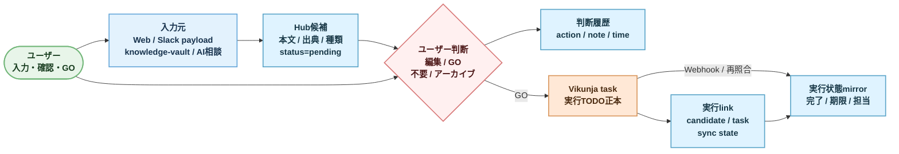

# P0 データフロー 2026-07

## 目的

P0 の実装済み入口から入った情報が、候補・判断・実行状態へどう変換されるかを固定する。

## 前提

- P0 の入口は `web`、`slack` payload、`knowledge_vault`、`chat`。
- Misskey と Google Calendar は P0 外。
- 全候補を `pending` で受け、人の GO なしに Vikunja task を作らない。
- P0 実装は adapter から直接共通 `candidates` へ正規化する。独立 Raw event store は P1 候補。

## データフロー

## P0 の正本

| データ | 正本 | 備考 |
| --- | --- | --- |
| source設定 | Hub SQLite `sources` | 有効状態と最終取り込み時刻 |
| 候補 | Hub SQLite `candidates` | source / source_path を保持 |
| 候補タグ | Hub SQLite `candidate_tags` | tag master と分離 |
| 判断 | Hub SQLite `decisions` | edited / approved / rejected / archived |
| AI相談 | Hub SQLite `chat_*` | 提案は人の操作後だけ candidate 化 |
| 実行TODO | Vikunja | Hub は編集正本を複製しない |
| 実行link | Hub SQLite `execution_links` | 1候補1taskを基本とする |
| 実行状態 | Hub SQLite `execution_task_state` | Vikunjaの許可済みfieldだけをmirror |
| 同期履歴 | Hub SQLite `source_sync_runs` / `sync_events` / `sync_attempts` | source単位の開始・完了・件数、署名、冪等、失敗・再照合 |

## 不変条件

- AI相談の提案は `chat_task_suggestions` に置き、ユーザー操作後だけ `candidates.status=pending` へ追加する。
- 同じ candidate の GO は成功済みlinkを返し、taskを二重作成しない。
- Vikunja task title は実行表示に記録しても、候補 title を勝手に上書きしない。
- token、Webhook secret、provider header は SQLite・画面・会話履歴へ保存しない。
- 本流DBに mock 候補をseedしない。

## P1へ送る設計課題

Raw入口イベントの独立保存、差分cursor、重複束ね、PostgreSQL移行は `docs/product/p1-phase-brief-2026-07.md` で導入条件を管理する。
