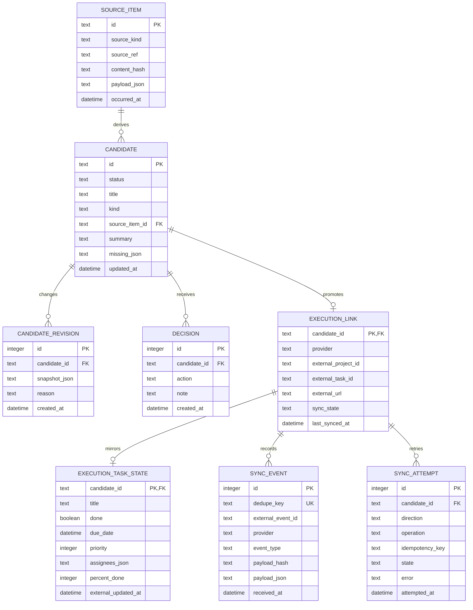

# Vikunja連携データ設計 2026-07

## 方針

保持したいデータが増えることを前提に、Vikunjaを全データの格納先にはしない。
`pj-general` は候補・出典・判断・同期履歴の正本、Vikunjaは実行TODOの正本とする。

## データ所有権

| データ | 正本 | pj-generalで保持するもの | Vikunjaへ送るもの |
| --- | --- | --- | --- |
| 入口原文 | pj-general | payload、本文、URL、取得時刻、hash | 参照URL・短い要約 |
| AI候補 | pj-general | summary、kind、confidence、missing、提案 | GO後のtask title/descriptionの一部 |
| 判断 | pj-general | action、note、操作者、時刻 | 登録結果のみ |
| 実行TODO | Vikunja | 外部ID、URL、最終同期値 | title、description、期限、担当、priority |
| 同期 | pj-general | event、attempt、error、last_seen | webhook payloadの送信 |

## 論理モデル



## P0で追加する最小テーブル

既存の`candidates`と`decisions`を維持し、まず以下を追加する。

```sql
create table if not exists execution_links (
  candidate_id text primary key,
  provider text not null,
  external_project_id text not null,
  external_task_id text not null unique,
  external_url text not null,
  sync_state text not null default 'created',
  last_synced_at text,
  created_at text not null,
  updated_at text not null
);

create table if not exists sync_events (
  id integer primary key autoincrement,
  dedupe_key text not null unique,
  external_event_id text,
  provider text not null,
  event_type text not null,
  payload_hash text not null,
  payload_json text not null,
  received_at text not null,
  processed_at text,
  processing_state text not null default 'received',
  error text
);

create table if not exists execution_task_state (
  candidate_id text primary key,
  title text not null,
  done integer not null default 0,
  due_date text,
  priority integer,
  assignees_json text not null default '[]',
  percent_done integer,
  external_updated_at text,
  mirrored_at text not null
);

create table if not exists sync_attempts (
  id integer primary key autoincrement,
  candidate_id text,
  provider text not null,
  direction text not null,
  operation text not null,
  idempotency_key text not null unique,
  state text not null,
  error text,
  attempted_at text not null
);
```

## IDと冪等性

- GO登録の冪等キーは `provider + candidate_id` とする。
- `execution_links.candidate_id` を主キーにし、1候補1実行taskを基本とする。
- Webhookは内部連番IDを持ち、外部event IDは任意列にする。`dedupe_key`は外部event IDまたはpayload hashから生成する。
- 外部APIが成功してDB保存だけ失敗した場合に備え、再照合でtask titleやdescriptionに候補IDを含める。
- 削除はP0では物理削除せず、`archived`または`sync_state=detached`として保持する。

## 状態遷移

状態は混ぜずに3軸で管理する。

```text
候補判断: pending -> edited -> approved / rejected / archived
外部同期: not_requested -> sync_pending -> synced / sync_failed -> sync_pending
外部task: open <-> done、存在しない場合はmissing（execution_task_stateで保持）
```

GO判断が保存済みでも外部API失敗は起こり得るため、`candidate.status=approved`と`execution_links.sync_state=sync_failed`は同時に成立してよい。

## 将来のPostgreSQL移行

- P0はSQLiteで実装する。
- JSONは原文・payload・候補スナップショットなど履歴性が必要な部分に限定する。
- 一覧検索、状態、provider、外部ID、時刻は通常列にする。
- PostgreSQL移行時に`sync_attempts`をworkerのoutboxへ切り出し、Redis/BullMQは再試行実行に使う。
