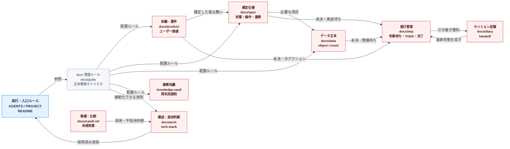
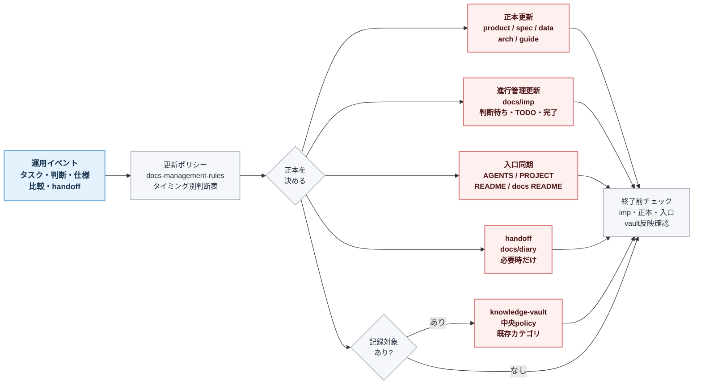
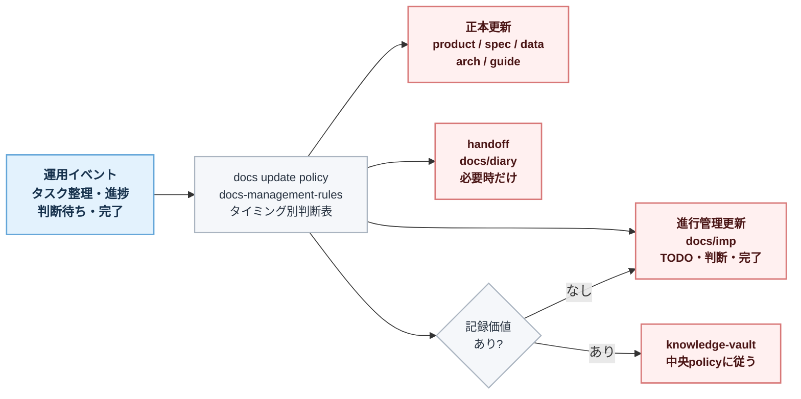

# docs 管理マトリクス結果図

## 目的

この文書は、`docs/guide/docs-management-rules.md` のマトリクス結果を図で把握するための要約である。

結論は、`正本を1つ決める`、`同期先には要約・リンク・状態だけ置く`、`進行管理とセッション記録を正本化しない` の3点である。

## 正本と同期先の全体像

## 更新漏れしないための仕組み

## タイミング別更新ゲート

## 読み取り

- 色分けは、入力口を青、出力先を赤、その他の判断・ルール・確認をグレーに統一する。
- `docs/guide/docs-management-rules.md` が docs 配置と相互更新ルールの正本である。
- タスク整理、進捗、判断待ち、完了、handoff の各タイミングでは、`docs/guide/docs-management-rules.md` のタイミング別更新判断表を見る。
- 変更が起きたら、まず正本を決め、正本、進行管理、入口、handoff、knowledge-vault の順に更新要否を判定する。
- `docs/imp/*` は判断待ち、実装待ち、完了記録を追うための正本であり、作業状態はここから復元できるようにする。
- `AGENTS.md`、`PROJECT.md`、`README.md`、`docs/README.md` は入口同期先であり、重要文書の追加や起動ルール変更時にだけ必要最小限で更新する。
- knowledge-vault へは、横断的な知見だけでなく、判断経緯や後から復元価値のある作業記録も中央 policy に従って反映する。
- `docs/diary/*` は最新状況を知る入口にはなるが、最新状態の正本にはしない。
- `docs/spec/*`、`docs/product/*`、`docs/data/*`、`docs/arch/*` には確定した設計内容を置き、TODO や判断待ちを長く残さない。
- `docs/candi-ref/*` の比較が採用・不採用判断に変わったら、`docs/arch/*` または `tech-stack.md` へ昇格させる。
- 最終報告や handoff 前に、`docs-management-rules.md` のセッション終了時チェックで更新漏れを確認する。
