# P0 全体要約ワークフロー 2026-07

## 目的

P0 で実際に利用できる、入口から実行 TODO までの業務フローを固定する。

## P0 の達成条件

P0 は次の実装済み入口を同じ確認待ちキューへ集約する。

- Web 手入力
- knowledge-vault Markdown 取り込み
- Slack `memo-ideas` の connector / 手動 payload 取り込み
- ローカル LLM 相談からの、ユーザー確認付き候補追加

Slack / knowledge-vault / AI相談は共通v3で、具体的な未完了作業`action`と、まだ曖昧なやりたいこと`aspiration`を分ける。Misskeyはpayload以降の同じ候補化だけ先行実装し、実接続はP0に含めない。Google Calendar登録もP0外とする。入口から候補化し、ユーザーが編集・GOし、Vikunjaで実行し、実行状態をHubへ反映できることをP0の一続きの達成条件とする。

## 全体要約ワークフロー

```mermaid
flowchart LR
    User(["ユーザー<br/>入力・確認・GO"]):::user
    Sources["実装済み入口<br/>Web / Slack payload<br/>knowledge-vault / AI相談"]:::inputMain
    Pool["Hub候補<br/>出典・本文・分類<br/>全件 pending"]:::main
    Review{"確認待ち<br/>編集 / GO<br/>不要 / アーカイブ"}:::decision
    Task["Vikunja実行TODO<br/>1候補1task"]:::external
    Mirror["状態反映<br/>Webhook / 再照合<br/>完了・期限・担当"]:::main
    Dashboard["横断表示<br/>候補・判断・Tasks概要<br/>日付付き実データ"]:::main
    Chat["ローカルLLM<br/>読取context<br/>候補提案"]:::auto

    User -->|手入力| Sources
    User -->|相談| Chat
    Chat -->|候補として追加| Sources
    Sources --> Pool
    User -->|確認・修正| Review
    Pool --> Review
    Review -->|GO| Task
    Review -->|編集・不要・保管| Pool
    Task --> Mirror
    Mirror --> Dashboard
    Pool --> Dashboard

    classDef user fill:#e8f5e9,stroke:#73b77a,color:#183d1f,stroke-width:2px,font-size:16px,font-weight:bold
    classDef inputMain fill:#fff0e4,stroke:#d9965c,color:#4a2a10,stroke-width:1.8px,font-size:16px,font-weight:bold
    classDef main fill:#ffe8d6,stroke:#d9965c,color:#4a2a10,stroke-width:1.8px,font-size:16px,font-weight:bold
    classDef auto fill:#f3e8ff,stroke:#a986d8,color:#302044,stroke-width:1.8px,font-size:16px,font-weight:bold
    classDef decision fill:#fff0f0,stroke:#d87878,color:#4a1515,stroke-width:1.8px,font-size:16px,font-weight:bold
    classDef external fill:#e3f2fd,stroke:#64a6d9,color:#17324d,stroke-width:1.8px,font-size:16px,font-weight:bold
```

## 固定する境界

- 入口ごとの差は source adapter に閉じ、本人本文を共通v3へ渡してaction / aspiration候補として受ける。
- いきなり実行登録せず、全件を確認待ちにする。
- AI相談も `提案 + 人の候補追加 + 人の GO` とする。
- GO 後の実行編集は Vikunja で行う。Hub は候補本文を逆同期しない。
- Tasks側の完了・期限・担当・進捗だけを Hub の実行状態へミラーする。
- P0 の GO は Vikunja task 作成であり、Calendar event は作らない。

## 画面の責務

### 横断ダッシュボード

- 候補、判断、Vikunja 概要、実行状態を集約する。
- 日付を持つ SQLite 候補・Vikunja実行状態だけを Tasks 連携予定表示へ投影する。

### 書き入れ口

- Web 手入力を最短で pending 候補にする。

### 確認待ち

- 候補を編集し、GO / 不要 / アーカイブを判断する。

### AI相談

- Hub / Tasks の許可済み要約を読んで相談回答を作り、候補は直近user messageだけから別処理で提案する。
- LLM 自身は候補追加・GO・タスク編集を実行しない。

### 管理

- source、tag、role表示、AI方針、取り込み範囲、prompt template を管理する。

## P1 以後に広げるもの

- Misskey 実接続
- Google Calendar 連携
- 定期入口同期 worker
- 重複束ねと部分自動確定の PoC
- 認証・組織権限
- PostgreSQL / queue 基盤
