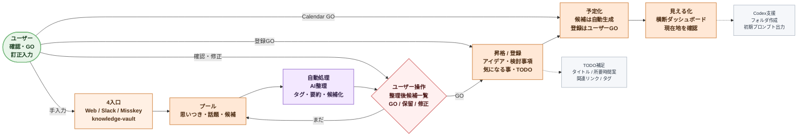

# P0 全体要約ワークフロー図 2026-07

## 目的

この文書は、P0 でユーザーがどんな流れを使えるようになるかを、業務目線で要約したワークフロー図である。

技術構成ではなく、`思いつきが入ってから整理され、TODO 化され、必要なら予定化されるまで` の全体像を固定する。

## P0 の達成条件

- `web 手入力`
- `Slack`
- `Misskey`
- `knowledge-vault`

この 4 入口から情報を受けられること。

そのうえで、次がつながること。

- プール
- AI 整理
- ユーザー GO
- TODO 化
- 必要なら予定化
- ガント表示

## 全体要約ワークフロー

## この図で固定したいこと

- 入口は 4 つでも、まずは `入口イベント` として受ける
- いきなり確定登録せず、`AI 整理後候補一覧` を経由する
- 初期の AI は `ノンストップ自動確定` ではなく `提案 + 人の GO`
- 図では `ユーザー` actor から矢印が出ている箇所を人の操作点とする
- 紫系の `自動処理` は AI / job が進める箇所とする
- TODO 化と予定化は分けて考える
- `1 タスクから複数予定` を許容する
- 横断ダッシュボードは、最終的な見える化の集約点とする

## 画面の主な責務

### 1. 横断ダッシュボード

- 全データの流入と現在地を見える化する
- TODO、予定、整理候補、昇格済みアーカイブを追えるようにする
- MVP ではガント表示もここに含める

### 2. 書き入れ口 / 作成口

- Web 手入力の最小入口
- 手で思いつきを入れる最短導線

### 3. 管理画面

- 分類タグマスタ
- Codex プロンプトテンプレート
- 入口ごとの設定

### 4. 実績 / 履歴参照

- P0 では優先度は低い
- ただし将来、昇格の履歴や予定実績の参照先になる

## P0 以後に広げるもの

- AI の即確定自動化
- ゆるい重複束ね
- キャパ管理
- 外部協力者向け権限の本実装
