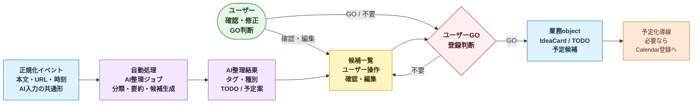
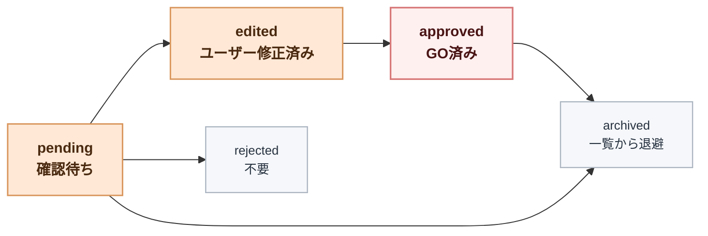
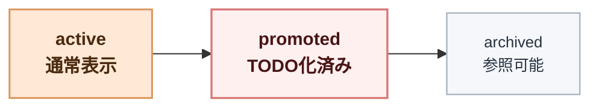
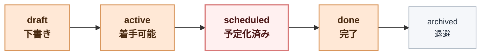

# P0 AI 整理・登録支援フロー

作成日: 2026-07-02

## 目的

この文書は、P0 で `正規化イベント` から AI が整理候補を作り、ユーザーの GO によって `アイデアカード`、`検討事項`、`気になっている事`、`TODO`、`予定候補` へ昇格する流れを定義する。

ここでは AI の prompt 詳細や DB schema は確定しない。P0 で必要な確認点、状態、責務境界を固定する。

## 前提

- 入口は `web 手入力`、`Slack`、`Misskey`、`knowledge-vault` の 4 つ。
- 入口 payload は `docs/spec/intake-unified-event-model.md` の `Raw入口イベント` と `正規化イベント` を経由する。
- P0 薄く実装 1 版は AI 整理結果をすべて確認待ちにし、`AI 提案 + ユーザー GO` を基本にする。
- P0 全体完了時点で、confidence、source_type、candidate_kind、タグ、欠落項目の有無を使った部分自動確定へ進める。
- 分類はタグマスタを使い、AI は候補を選ぶ。
- ユーザーは AI 提案を訂正して登録できる。
- 重複は P0 では許容する。

## 中心価値

ユーザーが最も避けたいのは、思いつきや気になることを、タスク化するまで頭の中で保持し続けることである。

P0 の AI 整理は、完璧な自動処理ではなく、次の状態を最短で作ることを目的にする。

- 入力済みプールを AI が理解する
- 登録候補を一覧で見られる
- ユーザーが GO しやすい
- GO 後に必要な情報がある程度そろう
- 欠けている情報は AI 提案を人が直せる

## フロー概要

## AI整理結果

AI整理結果は、正規化イベントに対する AI の提案であり、まだ業務 object の正本ではない。

### 必須フィールド

| Field | 意味 |
| --- | --- |
| `id` | AI整理結果ID |
| `normalized_event_id` | 元の正規化イベント |
| `summary` | 短い要約 |
| `classification_tags` | タグマスタから選んだ候補 |
| `candidate_kind` | `idea` / `consideration` / `concern` / `todo` / `schedule_candidate` |
| `review_status` | `pending` / `edited` / `approved` / `rejected` / `archived` |
| `confidence` | AI の自信度。自動化判定の将来材料 |

### 任意フィールド

| Field | 意味 |
| --- | --- |
| `title_candidate` | 登録時タイトル候補 |
| `task_proposals` | TODO 案 |
| `schedule_proposals` | 予定案 |
| `estimated_minutes` | 所要時間案 |
| `related_links` | 参照リンク |
| `reasoning_note` | 人間向けの短い理由。長い chain-of-thought は保存しない |
| `missing_fields` | AI が不足と判断した項目 |

## 候補種別

| 種別 | 意味 | P0 での扱い |
| --- | --- | --- |
| `idea` | まだ具体化前の思いつき | アイデアカードとして登録 |
| `consideration` | もう進めたい検討事項 | アイデアカードの subtype または検討事項 object |
| `concern` | ニュース記事、テーマ、気になっていること | 気になっている事として蓄積 |
| `todo` | すぐ着手候補になる作業 | TODO として登録 |
| `schedule_candidate` | 予定候補 | TODO に紐づく予定候補として保持 |

## 確認画面の責務

P0 の確認画面は、AI の正しさを説明する場ではなく、ユーザーが登録判断を短時間で行う場である。

図では `ユーザー` actor から矢印が出ている箇所を人の操作点、紫系の `自動処理` を AI / job が進める箇所として扱う。

### 表示するもの

- タイトル候補
- 要約
- 候補種別
- タグ候補
- 関連リンク
- TODO 案
- 所要時間案
- 予定案
- 元イベントへの内部参照
- 入口種別
- AI の自信度
- AI が不足と判断した項目
- GO 後に作られる object のプレビュー

### 操作

| 操作 | 意味 |
| --- | --- |
| `GO` | 提案を業務 object に昇格する |
| `編集` | タイトル、タグ、種別、TODO案などを修正対象にする。P0 薄く実装 1 版では `edited` 状態にする |
| `不要` | rejected にする。Raw / 正規化イベントは追跡用に残す |
| `アーカイブ` | 一覧から退けるが後で見られる |

### P0 薄く実装 1 版の確認待ちキュー

主参照は `shadcn/ui Tasks example` と `Plane Intake / AI triage` とする。

一覧の最小列は次とする。

| 列 | 意味 |
| --- | --- |
| `status` | `pending` / `edited` / `approved` / `rejected` / `archived` |
| `title_candidate` | タイトル候補 |
| `candidate_kind` | `idea` / `consideration` / `concern` / `todo` / `schedule_candidate` |
| `source_type` | `web` / `slack` / `misskey` / `knowledge_vault` |
| `classification_tags` | AI が選んだタグ候補 |
| `confidence` | AI の自信度 |
| `missing_fields` | 不足項目 |
| `occurred_at` | 元データ上の発生時刻 |

行クリックまたは詳細 pane で、要約、元本文、関連リンク、TODO 案、予定案、GO 後プレビューを見せる。

P0 薄く実装 1 版では、`confidence` が高くても自動承認しない。すべて `pending` として人が GO する。

## GO 後の作成ルール

### アイデアカード作成

- `idea`、`consideration`、`concern` は、まずアイデアカード系の object として残す。
- `consideration` は `もう進めたいこと` として扱う。
- `concern` は `ニュース記事やテーマなど、気になっていること` として扱う。
- アイデアカード一覧は時系列積み上げを初期表示にする。

### TODO 作成

- `todo` 候補への GO、またはアイデアカードからの GO で TODO を作る。
- TODO 化の最低条件は厳密に置かない。
- 欠けている情報は AI が提案し、ユーザーが訂正できる。
- P0 の TODO 最小表示項目は `タイトル`、`所要時間案`、`関連リンク`、`タグ` とする。

### 予定候補作成

- `1 タスク : 多予定` を許容する。
- 予定化の最低条件は厳密に置かない。
- Google Calendar 直接登録は、ユーザー GO を前提にする。
- GO 導線は `TODO 概要`、`TODO 詳細`、`予定候補一覧` から用意する。
- アイデア一覧から Google Calendar へ直接登録する導線は P0 では不要。

## 状態遷移

### AI整理結果

### アイデアカード

`promoted` 後も物理削除しない。昇格済みアーカイブとして、見ようと思えば見られる状態にする。

### TODO

P0 では複雑なステータス管理より、登録後の煩雑さを抑えることを優先する。

## 自動化レベル

| Level | 内容 | P0 |
| --- | --- | --- |
| L0 | AI なし。手入力だけ | 補助的に許容 |
| L1 | AI が分類、要約、候補を出す | 採用 |
| L2 | ユーザー GO で登録する | P0 薄く実装 1 版で採用 |
| L3 | 条件付きで自動登録する | P0 全体完了時点で部分採用へ進める |
| L4 | ノンストップでタスク化、予定化する | 後段 |

## P0 で決めること

- AI は `正規化イベント` を入力にする。
- AI整理結果は正本 object ではなく、確認前の提案として保持する。
- P0 薄く実装 1 版では、AI整理結果はすべて確認待ちにする。
- タグマスタを使い、AI は既存タグから候補を選ぶ。
- ユーザー GO を経て業務 object に昇格する。
- アイデアカードと TODO は別 object として残す。
- TODO 化後も元アイデアカードは昇格済みアーカイブとして残す。
- 予定化は TODO の後段導線とし、1 TODO から複数予定を許容する。
- P0 全体完了時点で、部分自動確定の条件を再設計する。

## P0 では決めないこと

- AI prompt の全文。
- confidence による自動承認条件。
- タグマスタの完全な分類体系。
- Google Calendar API payload の詳細。
- 重複候補の自動束ね。

## 後続設計

- `docs/data/object-model-initial.md`
- `docs/spec/google-calendar-linkage-flow.md`
- `docs/spec/classification-tag-master.md`
- `docs/spec/codex-project-bootstrap-flow.md`
