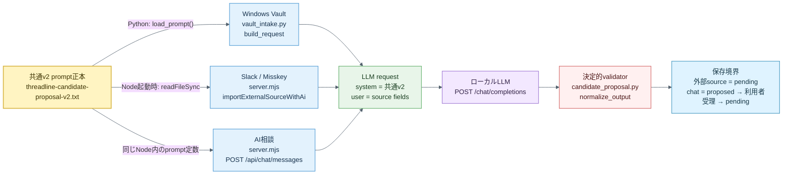

# P0 共通AI候補提案契約

## 目的と正本

knowledge-vault、Slack、Misskey、AI相談で、入口ごとに異なる文章を同じ品質基準でHub候補へ変換する。source adapterは取得・話者限定・source reference生成を担い、この契約は正規化済み本文から候補を提案・検証する段階だけを担う。

runtime promptの正本は`apps/web/prompts/threadline-candidate-proposal-v2.txt`、決定的validatorの正本は`apps/web/candidate_proposal.py`である。旧`knowledge-vault-task-proposal-v1.txt`は過去batchの意味を復元する履歴として残し、新規実行には使わない。

## runtimeへの組込み・実行位置

- Windows Vault経路は`vault_intake.py`から`candidate_proposal.build_request()`を呼び、その時点で`load_prompt()`がpromptファイルをUTF-8読込する。
- Slack / Misskey / AI相談経路はHub起動時に`server.mjs`がpromptファイルを`readFileSync`し、`callCandidateProposalLlm()`のsystem messageへ注入する。prompt変更をLinux Hubへ反映するには安全再配信またはHub再起動が必要である。
- LLMへ渡すuser messageは`SOURCE_KIND`、`SOURCE_REF`、`ALLOWED_TAGS`、`SOURCE_BODY`だけである。相談回答や別source本文を混ぜない。
- 管理画面の`candidate-triage`本文は利用者向けの短い説明であり、runtime promptではない。
- 設計済み・未実装のSlack / Misskey定期workerは`candidate_proposal.build_request()`を再利用し、別promptを作らない。

## 入力契約

| 入力 | 契約 |
| --- | --- |
| `SOURCE_KIND` | `knowledge_vault` / `slack` / `misskey` / `chat` |
| `SOURCE_REF` | adapterが作る相対path、permalink、note URL、chat user message URI。本文の事実根拠には使わない |
| `ALLOWED_TAGS` | Hubで可視のタグ名。完全一致だけを出力に許す |
| `SOURCE_BODY` | 候補判定の唯一の事実根拠。12,000文字を上限とする |

Slack / Misskey adapterは本人の対象投稿だけを`SOURCE_BODY`へ渡す。AI相談は直近のuser messageだけを渡し、assistant回答、read-only context、過去会話を候補根拠へ混ぜない。knowledge-vault collectorは秘密らしい行を伏せた本文を渡す。

## 候補の二分類

| `proposal_type` | 意味 | Candidate `kind` | `todo` |
| --- | --- | --- | --- |
| `action` | 明示された未完了TODO、依頼、修正、調査、判断待ち | `todo` | 原文から対象・行動・期待結果が分かる実行句 |
| `aspiration` | 本人の「いつかやりたい」「試したい」「関心がある」「できたらいい」という未確定の希望 | `idea` | 希望を表す完全一致引用そのもの。実装手段や次作業へ具体化しない |

同じ根拠にactionとaspirationが重複した場合はactionだけを残す。aspirationをactionへ昇格するのはLLMではなく、Hubで内容を見たユーザーの編集・GO判断である。

## 出力・validator契約

LLMはJSON objectの`document_summary`と`candidate_proposals[]`だけを返す。各proposalは`proposal_type`、`title`、`summary`、`todo`、`kind`、`schedule`、`confidence`、`missing`、`tags`、`evidence_quotes`を持つ。

validatorは次を決定的に検査し、一つでも違反したproposalを`held`にする。

- 根拠引用が`SOURCE_BODY`へ完全一致し、完了checkboxまたはMarkdown引用行ではない。
- actionは`kind=todo`で、単独の「確認する」「整理する」等ではない。
- aspirationは`kind=idea`で、`todo`が希望の根拠引用と完全一致し、希望表現を持つ。
- `schedule`は根拠本文にある有効な`YYYY-MM-DD`か`候補なし`である。
- tagsは`ALLOWED_TAGS`内、confidenceは既知enumで、lowはheldである。
- 原文にない担当、期限、Project、成果物、実装方法をacceptedへ通さない。

## source別フロー

| Source | 取得境界 | 共通提案の後 | 現在の実装範囲 |
| --- | --- | --- | --- |
| knowledge-vault | Windows collectorだけがVaultを読む | batch lineageへ保存し、acceptedだけ`KVAI-*` pending候補 | 取得、提案、batch、Linux importまで実装済み |
| Slack | connectorまたは手動payloadが対象投稿を渡す | `POST /api/import/slack`がv2を実行し、acceptedだけ`SLAI-*` pending候補 | payload以降を実装済み。Slack認証・pollingは未実装 |
| Misskey | 将来connectorが対象noteを渡す | 有効化済みsourceへの`POST /api/import/misskey`がv2を実行し、acceptedだけ`MKAI-*` pending候補 | payload以降を実装済み。sourceは既定無効、外部取得・認証は未実装 |
| AI相談 | `POST /api/chat/messages`の直近user message | 相談回答とは別のLLM呼出とvalidatorで提案し、ボタン受理後だけ`candidates.status=pending` | 実装済み |

Slackの`mode=legacy_direct`とLinuxローカルvault scanは回帰互換経路であり、新しい品質受入には使わない。

## 状態・安全境界

- LLMは候補を直接GOせず、Vikunjaへ書かない。
- Slack / Misskey / Vaultのaccepted proposalは`candidates.status=pending`まで、AI相談は`chat_task_suggestions.status=proposed`まで自動で進む。
- AI相談の候補抽出だけが失敗した場合、相談回答は保存・表示し、候補を合成しない。
- sourceが無効、本文が空、不正JSON、根拠不一致の場合は候補を作らない。
- 再実行はsource kind、source ref、proposal identityから決めたIDで重複をskipする。

## 回帰根拠

| 確認対象 | 自動根拠 |
| --- | --- |
| v2 prompt、二分類、根拠、aspiration非具体化、action優先 | `apps/web/test/test_candidate_proposal.py` |
| Vault batchへの共通validator適用とfallback | `apps/web/test/test_vault_intake.py` |
| Slack / Misskeyのpending写像、held、冪等 | `apps/web/test/test_source_sync.py` |
| Slack / Misskey HTTPフロー、AI相談のuser message限定、pending止まり | `apps/web/test/api.test.mjs` |

## 非対象

- Slack / Misskeyの認証方式、全件検索、polling / Streaming / Webhook選定。
- 複数投稿を跨ぐ意味的dedupe、第三者発言の高度な話者推定。
- confidenceによる自動GO、部分自動確定。
