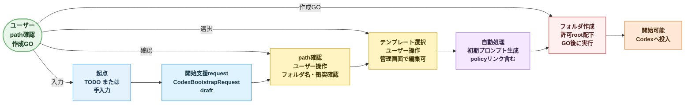

# P0 Codex プロジェクト開始支援フロー

作成日: 2026-07-02

## 目的

この文書は、P0 で実装する Codex プロジェクト開始支援の最小フローを定義する。

この機能は、タスク管理から派生して新しい PJ 作業を始めるときに、フォルダ作成と初期プロンプト出力を補助する。

## 前提

- P0 で最低限入れる。
- Web からタスク名または作業名を元にフォルダを新規作成する。
- フォルダ名は手動指定でよい。
- 初期プロンプトを出力する。
- プロンプトテンプレートは管理画面から編集可能にする。
- `pj-general` の初期化資産を参考にするが、PJ 固有に編集してから開始する前提。

## 対象ユーザー

P0 では自分のみを主利用者とする。

外部協力者向けの PJ 作成権限やレビュー導線は後段に回す。

## フロー概要

## 入力

| 入力 | 必須 | 意味 |
| --- | --- | --- |
| `project_name` | 必須 | PJ 名または作業名 |
| `folder_path` | 必須 | 作成先 path |
| `todo_id` | 任意 | 元 TODO |
| `prompt_template_id` | 必須 | 利用する初期プロンプトテンプレート |
| `notes` | 任意 | 追加前提や依頼内容 |

## 出力

| 出力 | 意味 |
| --- | --- |
| 作成フォルダ | Codex 作業用の PJ root |
| 初期プロンプト | Codex に渡す開始指示 |
| 初期 docs 候補 | `AGENTS.md`、`PROJECT.md`、docs 構造のコピー候補 |
| 作成記録 | `CodexBootstrapRequest.status` と生成結果 |

## テンプレート管理

P0 では、テンプレートを過度に自動推薦しない。

管理画面で次を編集できるようにする。

- プロンプトテンプレート名
- テンプレート本文
- デフォルト参照元
- 出力時の注意事項

### 初期テンプレート候補

| テンプレート | 用途 |
| --- | --- |
| `pj-general-derived` | `pj-general` の AGENTS / PROJECT / docs 構造を引き継ぐ |
| `small-task` | 小さな単発作業 |
| `research-docs` | 調査と設計書作成中心 |

## フォルダ作成

P0 では命名を AI に任せ切らない。

ユーザーが最終 path を確認し、GO したら作成する。

図では `ユーザー` actor から矢印が出ている箇所を人の操作点、紫系の `自動処理` をシステムが生成する箇所として扱う。

### 作成前チェック

- path が空でない
- 既存フォルダと衝突しない
- 作成先が許可された root 配下である
- secret や認証情報をテンプレートに含めない

## 初期プロンプト

初期プロンプトには、次を含める。

- PJ の目的
- 正本ディレクトリ
- 参照する AGENTS / PROJECT / docs
- knowledge-vault へ書く前に `G:\knowledge-vault\knowledge-vault-write-policy.md` を読むこと
- PJ 固有情報と横断ナレッジの分離
- 最初に読むファイル
- 最初に作る成果物

## CodexBootstrapRequest

| Field | 意味 |
| --- | --- |
| `id` | ID |
| `todo_id` | 元 TODO。任意 |
| `project_name` | PJ 名 |
| `folder_path` | 作成先 |
| `prompt_template_id` | 利用テンプレート |
| `generated_prompt` | 生成された初期プロンプト |
| `status` | `draft` / `ready` / `created` / `archived` / `error` |
| `created_at` | 作成時刻 |

## P0 で決めること

- Codex 開始支援は P0 に含める。
- 最小機能は `フォルダ作成` と `初期プロンプト出力`。
- フォルダ名は手動確認を必須にする。
- プロンプトテンプレートは管理画面で編集できる。
- knowledge-vault への書き込みルールは中央 policy へリンクする。

## P0 では決めないこと

- 複数エージェント用の高度な profile。
- upstream repo の自動選定。
- PJ 種別ごとの完全なテンプレート推薦。
- GitHub repo 作成の自動化。
- secret 配置や外部認証情報の自動投入。

## 後続設計

- `docs/spec/prompt-template-management.md`
- `docs/spec/project-folder-safety-policy.md`
- `docs/spec/role-and-permission-initial.md`
