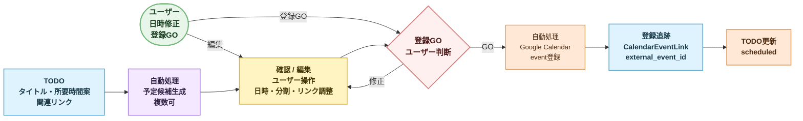

# P1 Google Calendar 一方向PoCフロー

作成日: 2026-07-02

## 目的

この文書は、P1後半PoCにおけるVikunja task / Hub候補からGoogle Calendar予定を作る一方向フロー候補を定義する。P0では未実装である。

ここでは Google Calendar API の payload 詳細は確定しない。ユーザーがどこで GO し、どの object が作られ、登録後に何を追跡するかを固定する。

## 前提

- Google Calendar直接登録はP1後半PoCとする。
- ただし AI が勝手に登録するのではなく、ユーザー GO を必須にする。
- 1 TODO から複数予定に分割されてよい。
- 欠けている情報は AI が提案し、ユーザーが訂正できる。
- 入口はアイデア一覧ではなく、TODO 以降に置く。

## GO 導線

| 導線 | P0 方針 |
| --- | --- |
| TODO 概要 | 予定候補を見て、その場で GO できる |
| TODO 詳細 | 候補編集、分割、所要時間修正をして GO できる |
| 予定候補一覧 | 複数候補をまとめて確認し、選択して GO できる |
| アイデア一覧 | 直接 Calendar 登録しない |

## フロー概要

## ScheduleCandidate 作成

予定候補は TODO から作る。AI はカレンダーや周辺情報を読める範囲で利用し、足りない部分は仮提案する。

### 候補作成の入力

| 入力 | 使い方 |
| --- | --- |
| `Todo.title` | 予定タイトル候補 |
| `Todo.estimated_minutes` | 所要時間候補 |
| `Todo.related_links` | 予定 description の参照候補 |
| `Tag` | 作業種別や優先度の推定補助 |
| Calendar 空き情報 | 開始候補、分割候補の提案 |

### 候補の最小情報

| Field | 意味 |
| --- | --- |
| `title` | 予定名 |
| `start_candidate` | 開始候補 |
| `end_candidate` | 終了候補 |
| `duration_minutes` | 所要時間 |
| `description_candidate` | Calendar description 候補 |
| `reason_note` | なぜこの枠を提案したか |

## ユーザー確認

PoCでは、予定化に必要な項目が欠けていても候補を作れる設計を評価する。

図では `ユーザー` actor から矢印が出ている箇所を人の操作点、紫系の `自動処理` を AI / job / API が進める箇所として扱う。

ユーザーは確認画面で次を行う。

- 開始日時の修正
- 所要時間の修正
- タイトルの修正
- 複数予定への分割
- 関連リンクの削除または追加
- 登録対象候補の選択
- Google Calendar 登録 GO

## 登録後の追跡

登録に成功したら `CalendarEventLink` を保存する。

| Field | 意味 |
| --- | --- |
| `provider` | `google_calendar` |
| `external_event_id` | Google Calendar event id |
| `schedule_candidate_id` | 元候補 |
| `registered_at` | 登録日時 |
| `sync_status` | `registered` / `sync_error` / `deleted_external` |

P1 PoCではCalendar側編集を完全同期しない。まずは「このtaskからこの予定を作った」と追えることを優先する。

## Todo 更新

登録成功後、対象 TODO は `scheduled` にできる。

ただし、1 TODO から複数予定が生まれるため、すべての予定が登録されたかどうかは `ScheduleCandidate` 側で管理する。

## エラー時

| 状態 | 方針 |
| --- | --- |
| Calendar API 失敗 | `sync_error` として残し、再試行できるようにする |
| 権限切れ | ユーザーに再認証を促す |
| 候補不備 | 登録せず、候補編集に戻す |
| 一部候補だけ成功 | 成功分は `registered`、失敗分は `sync_error` |

## P1 PoCで決めること

- Calendar 登録は TODO 以降の導線に置く。
- 登録には必ずユーザー GO を必要とする。
- 1 TODO から複数 `ScheduleCandidate` を作れる。
- 登録後は `CalendarEventLink` で外部 event id を保持する。
- Calendar側の完全同期はPoC対象にしない。

## P1 PoCでは決めないこと

- Google Calendar API payload の完全仕様。
- recurring event 対応。
- Calendar 側編集の双方向同期。
- 自動空き時間最適化。
- GO なし自動登録。

## 後続設計

- `docs/spec/google-calendar-api-detail.md`
- `docs/data/history-and-audit-model.md`
- `docs/spec/notification-and-retry-policy.md`
