# P0 統一入口イベントモデル

> 状態: P1以降のRaw event store候補。現行P0はadapterから `candidates` へ直接正規化しており、このモデルを完全実装していない。現行正本は `docs/data/p0-data-flow-2026-07.md`。

作成日: 2026-07-02

## 目的

この文書は、将来の複数入口から入る情報を、共通の入口イベントとして扱うための候補モデルを定義する。

ここでは DB schema を確定しない。実装前に、どの情報を Raw として保存し、どの情報を AI 整理や確認画面へ渡す共通形にするかを固定する。

## 背景

価値は、思いつきや気になることを頭の中で管理せず、入口へ投げた後に `候補化 -> ユーザー GO -> Vikunja実行` へ進められることにある。

入口ごとに payload は異なるが、業務 object を入口別に増やすと破綻しやすい。そのため、入口の差異は `Raw入口イベント` と `正規化イベント` で吸収し、以後は共通の整理候補として扱う。

## 対象入口

| 入口 | P0 で受けるもの | 初期方針 |
| --- | --- | --- |
| `web 手入力` | タイトル、本文、URL、タグ候補 | 最初に実装する最小入口 |
| `Slack` | `memo-ideas` チャンネル内の、やりたいこと、困っていること、タスクっぽいこと | P0 は `https://unibell4-dev.slack.com/archives/C0BG4TCPAUD` を対象にし、全 Slack 横断回収はしない |
| `Misskey` | webhook で届く note data | note payload を Raw として保存 |
| `knowledge-vault` | diary 系、`records/`、`inbox/`、legacy `tasks/active/`、`tasks/handoff/`、`memory/l1-triggers.md`、`memory/l2-models/` のうち、やりたいこと、困っていること、タスクっぽいこと | 対象範囲内はいったん全件 scan / 差分検知で取り込む。`knowledge/` 正本や L3 以降は原則、初期回収対象ではなく参照補助に留める |

## データ状態

```mermaid
flowchart LR
    User(["ユーザー<br/>手入力<br/>確認GO"]):::user
    Source["入口payload<br/>Web / Slack / Misskey<br/>knowledge-vault"]:::input
    Raw["Raw入口イベント<br/>元データ保存<br/>追跡用"]:::data
    Normalized["正規化イベント<br/>本文・URL・時刻<br/>共通形"]:::data
    AI["自動処理<br/>AI整理結果<br/>分類・要約・候補生成"]:::ai
    Review["ユーザー操作<br/>候補一覧<br/>確認GO"]:::decision
    Object["業務object<br/>IdeaCard / TODO<br/>予定候補"]:::main

    User -->|Web手入力| Source
    User -->|確認・GO| Review
    Source --> Raw --> Normalized --> AI --> Review --> Object

    classDef user fill:#e8f5e9,stroke:#73b77a,color:#183d1f,stroke-width:2px,font-size:16px,font-weight:bold
    classDef input fill:#e3f2fd,stroke:#64a6d9,color:#17324d,stroke-width:1.5px,font-size:15px,font-weight:bold
    classDef data fill:#dff3ff,stroke:#5aa4c8,color:#173746,stroke-width:1.6px,font-size:15px,font-weight:bold
    classDef ai fill:#f3e8ff,stroke:#a986d8,color:#302044,stroke-width:1.6px,font-size:15px,font-weight:bold
    classDef decision fill:#fff0f0,stroke:#d87878,color:#4a1515,stroke-width:1.7px,font-size:15px,font-weight:bold
    classDef main fill:#ffe8d6,stroke:#d9965c,color:#4a2a10,stroke-width:1.5px,font-size:15px,font-weight:bold
```

## Raw入口イベント

Raw入口イベントは、入口から受けた元データを後から追跡できるように保存する状態である。

### 必須フィールド

| Field | 意味 |
| --- | --- |
| `id` | Raw入口イベントID |
| `source_type` | `web` / `slack` / `misskey` / `knowledge_vault` |
| `source_ref` | 入口側の識別子。Slack ts、Misskey note id、vault path など |
| `payload` | 入口から受けた元データ。JSON または text snapshot |
| `received_at` | このシステムが受けた時刻 |
| `occurred_at` | 元データ上の発生時刻。取れない場合は `received_at` と同じ |
| `ingest_status` | `received` / `normalized` / `ignored` / `error` |

### 任意フィールド

| Field | 意味 |
| --- | --- |
| `source_url` | URL として戻れる場合の参照先 |
| `content_hash` | 重複検知や差分検知の補助。P0 では強制 dedupe しない |
| `error_reason` | 取り込み失敗または無視理由 |

## 正規化イベント

正規化イベントは、AI 整理、候補一覧、検索、昇格判断に渡すための共通形である。

### 必須フィールド

| Field | 意味 |
| --- | --- |
| `id` | 正規化イベントID |
| `raw_event_id` | 元の Raw入口イベント |
| `source_type` | Raw と同じ入口種別 |
| `title` | 一覧表示や AI 入力に使う短い見出し |
| `body_text` | AI 整理対象の本文 |
| `occurred_at` | 元データ上の発生時刻 |
| `normalized_status` | `ready` / `needs_review` / `ignored` / `error` |

### 任意フィールド

| Field | 意味 |
| --- | --- |
| `links` | URL 配列 |
| `author_ref` | Slack user、Misskey user、vault author など。P0 では自分中心 |
| `source_label` | 人間向けの入口表示名 |
| `extracted_tags` | 入口側や本文から機械的に抽出したタグ候補 |
| `language` | 言語判定。必要になったら使う |

## AI整理結果との境界

正規化イベントは、AI が判断した分類やタスク案を持たない。

AI が作る情報は `AI整理結果` として別に扱う。

| AI整理結果に置くもの | 理由 |
| --- | --- |
| `summary` | AI の解釈であり Raw / 正規化とは分ける |
| `classification_tags` | タグマスタとの照合結果 |
| `idea_type_candidate` | `検討事項` / `気になっている事` などの候補 |
| `task_proposals` | TODO 化の候補 |
| `schedule_proposals` | 予定化の候補 |
| `confidence` | 自動化度合いを後で調整するため |

## 参照情報の方針

表示上、毎回出典を見せる必要はない。ただし内部的には、元データに戻れる参照情報を保持する。

| 参照 | P0 方針 |
| --- | --- |
| URL | 記事や外部ページ由来なら保持する |
| Slack / Misskey の投稿ID | 取得できるなら `source_ref` として保持する |
| knowledge-vault path | path と更新時刻を保持する |
| 手入力由来 | source_type が `web` であれば十分。出典表示は不要 |

## knowledge-vault 取り込み範囲

P0 薄く実装 1 版では、knowledge-vault 全域を無差別に AI 整理へ流さない。

暫定対象は次とする。

| 範囲 | P0 方針 | 理由 |
| --- | --- | --- |
| `records/` | 優先対象 | 日常の作業記録、handoff、セッション履歴があり、やりたいこと、困りごと、次アクションが出やすい |
| `inbox/` | 優先対象 | 未整理情報の一時置き場であり、検討したこと、知見の種、後で昇格すべき材料が入る可能性が高い |
| diary 相当 | 優先対象 | セッションや日次の流れから、未整理の意図やタスク候補を拾いやすい |
| `tasks/active/`, `tasks/handoff/` | 参照対象 | legacy だが、移行前のタスク状態や引き継ぎが残る |
| `memory/l1-triggers.md` | 参照対象 | 常時読む短い想起入口で、取り込み候補の発見に使える |
| `memory/l2-models/` | 参照対象 | 未確定モデルや違和感があり、困りごとや検討事項候補になり得る |
| `memory/l3-summaries/`, `memory/l4-records/` | 初期は原則対象外 | 要約・詳細入口であり、P0 ではノイズや重複が増えやすい。必要時に手動で追加する |
| `knowledge/` | 初期は原則対象外 | 整理済み知識の正本であり、未整理タスクの回収対象ではなく、AI 整理の文脈補助として扱う |
| `sources/`, `wiki/`, `templates/`, `scripts/` | 初期は対象外 | 根拠、派生ビュー、テンプレート、スクリプトであり、やりたいこと回収の主対象ではない |

現在構成の詳細は `docs/candi-ref/knowledge-vault-current-structure-for-intake.md` を参照する。

## 重複の扱い

P0 では重複を許容する。

重複削除や束ねを強制すると、入口実装と AI 整理が重くなるため、初期は `content_hash` や `source_ref` を保持するだけに留める。ユーザーが後で消せることを優先する。

将来、実装負荷が低く効果が大きい場合のみ、ゆるい束ねを候補として検討する。

## ステータス

### Raw入口イベント

| Status | 意味 |
| --- | --- |
| `received` | 受信済み、未正規化 |
| `normalized` | 正規化イベント作成済み |
| `ignored` | 取り込み対象外 |
| `error` | payload 破損、権限、parse 失敗など |

### 正規化イベント

| Status | 意味 |
| --- | --- |
| `ready` | AI 整理に渡せる |
| `needs_review` | 人間確認が必要 |
| `ignored` | AI 整理対象外 |
| `error` | 正規化後の不整合 |

## P0 で決めること

- 4入口はすべて `Raw入口イベント` として保存する。
- AI に直接入口 payload を渡さず、`正規化イベント` を経由する。
- 入口の違いは `source_type`、`source_ref`、`payload` に閉じ込める。
- AI の分類、要約、タスク案、予定案は Raw / 正規化イベントとは分ける。
- 図では `ユーザー` actor から矢印が出ている箇所を人の操作点とする。
- 紫系の `自動処理` は AI / job が進める箇所とする。
- 重複排除は P0 必須にしない。

## P0 では決めないこと

- DB table 名、index、migration の確定。
- Slack / Misskey / knowledge-vault の詳細 API 実装。
- 自動 dedupe。
- 入口ごとの細かい権限設計。
- Google Calendar の登録 payload。

## 後続設計

- `docs/spec/ai-assisted-registration-flow.md`
- `docs/data/object-model-initial.md`
- `docs/spec/google-calendar-linkage-flow.md`
- `docs/spec/intake-source-adapters.md`
