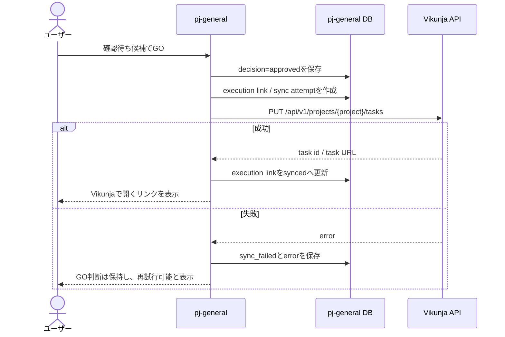
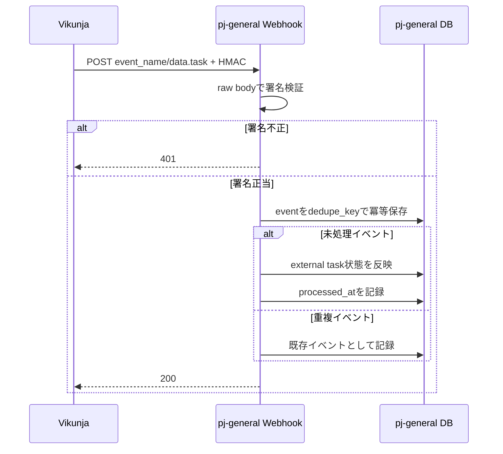

# Vikunja / pj-general 結合契約 2026-07

## 目的

Vikunja実機を起動する前に、pj-general側の結合境界を固定する。
初回実機検証は Vikunja `v2.3.0` を固定し、API v1で行う。main追随時のAPI差分はadapter内へ閉じ込める。

## 対象バージョン

| 対象 | task作成 | task更新 | 用途 |
| --- | --- | --- | --- |
| 安定版 `v2.3.0` | `PUT /api/v1/projects/{project}/tasks` | `POST /api/v1/tasks/{task}` | 初回実機検証の正本 |
| main `e992ed594` | `POST /api/v2/projects/{project}/tasks` | API v2契約に従う | 将来追随の調査対象 |

`VIKUNJA_API_BASE_PATH=/api/v1` をadapter設定に持たせ、画面や候補処理からresource pathを直接参照しない。

## 連携方向

| 名前 | 方向 | 意味 |
| --- | --- | --- |
| 候補 | 入口 -> pj-general | Web、Slack、knowledge-vaultから候補を作る |
| GO登録 | pj-general -> Vikunja | 確認済み候補を実行TODOにする |
| 状態反映 | Vikunja -> pj-general | task変更イベントを候補の実行情報へ反映する |
| 再照合 | pj-general -> Vikunja | Webhook欠落や失敗を補う |

## GO登録契約

内部APIの論理契約は次のとおりとする。

```text
POST /api/candidates/{candidate_id}/execution

request
{
  "provider": "vikunja",
  "project_id": "server-configured-project",
  "confirm": true
}

response 201
{
  "candidate_id": "KV-...",
  "provider": "vikunja",
  "external_task_id": "...",
  "external_url": "https://tasks.example/...",
  "sync_state": "synced"
}
```

main clone（2026-07-10確認、commit `e992ed594`）のAPI v2とは契約が異なる。安定版の実機では、release同梱のAPI資料と応答も照合する。

### GO登録の不変条件

- `confirm=true` はユーザーのGO操作からだけ発行する。
- 同じcandidateに対する成功済み登録は再作成せず、既存linkを返す。
- 外部API失敗時も`decisions`へGO判断を保存する。
- API tokenやWebhook secretをレスポンス、ログ、SQLiteへ書かない。
- task descriptionには、必要最小限の候補IDとpj-general URLを含める。

## Webhook受信契約

## GO登録シーケンス



## Webhook反映シーケンス



```text
POST /api/integrations/vikunja/webhook

headers
- X-Vikunja-Signature: <signature>

body
{
  "event_name": "task.updated",
  "data": {
    "task": { "id": 123, "title": "...", "done": false },
    "project": { "id": 1 }
  }
}
```

upstreamのE2Eテストで、payloadのイベント名は`event_name`、taskは`data.task`として確認できる。実payloadを`sync_events.payload_json`へ保存し、外部event IDは任意とする。冪等キーは外部event IDがあればそれを名前空間付きで使い、なければHMAC検証後のpayload hashから作る。
署名検証が失敗したイベントは候補状態を変更しない。

### Webhook処理順

1. 受信時刻とraw payloadを記録する。
2. 署名を検証する。
3. 外部event IDまたはpayload hashから`dedupe_key`を作り、重複を確認する。
4. `execution_links.external_task_id`を検索する。
5. 許可したfieldだけをpj-generalの実行情報へ反映する。
6. eventの処理結果を記録する。
7. HTTP成功を返す。失敗時は再配信に依存せず、照合対象として残す。

## 反映fieldの初期範囲

| Vikunja field | pj-generalへの反映 | 初期方針 |
| --- | --- | --- |
| task id / URL | execution link | 必須 |
| done / status | execution summary | 必須 |
| title | 実行タイトルのミラー | 記録するが候補タイトルは勝手に上書きしない |
| due date | 実行予定のミラー | 記録する |
| assignee | 担当のミラー | 記録する |
| priority | 実行属性 | 記録する |
| description | 原文・AI要約の正本ではない | 初期は取り込まない |
| comments | 判断履歴とは分離 | 後続 |

## 再照合

- Webhookの欠落を前提に、定期照合を別workerで実行する。
- 照合は`execution_links`にあるtaskだけを対象にする。
- 差分があれば同期イベントとして記録する。
- 外部taskが削除されていてもcandidate・decision・link履歴は削除しない。

## 拡張点の記録

不足機能は以下の表で記録し、解決方式を決める。

| 要求 | 標準API | Webhook | 外部連携 | plugin | frontend fork | backend fork | 根拠 |
| --- | --- | --- | --- | --- | --- | --- | --- |
|  |  |  |  |  |  |  |  |

`plugin`や`fork`を選ぶ前に、API・Webhook・pj-general側の実装で解決できないかを確認する。

## upstream確認根拠

- clone: `G:\devwork\clone-dir\vikunja-upstream`
- upstream commit: `e992ed594cc39044a55acf1c7b157501d43797f9`
- 安定版route: tag `v2.3.0` の `pkg/routes/routes.go`
- main task route: `pkg/routes/api/v2/tasks.go`
- webhook payload / signature: `pkg/models/webhooks.go`
- webhook E2E payload形: `pkg/e2etests/webhook_test.go`
